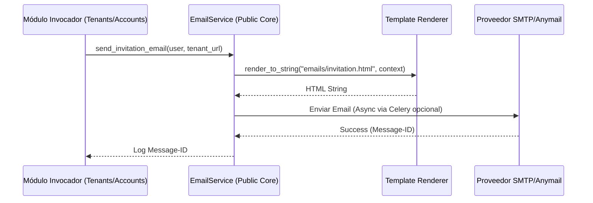
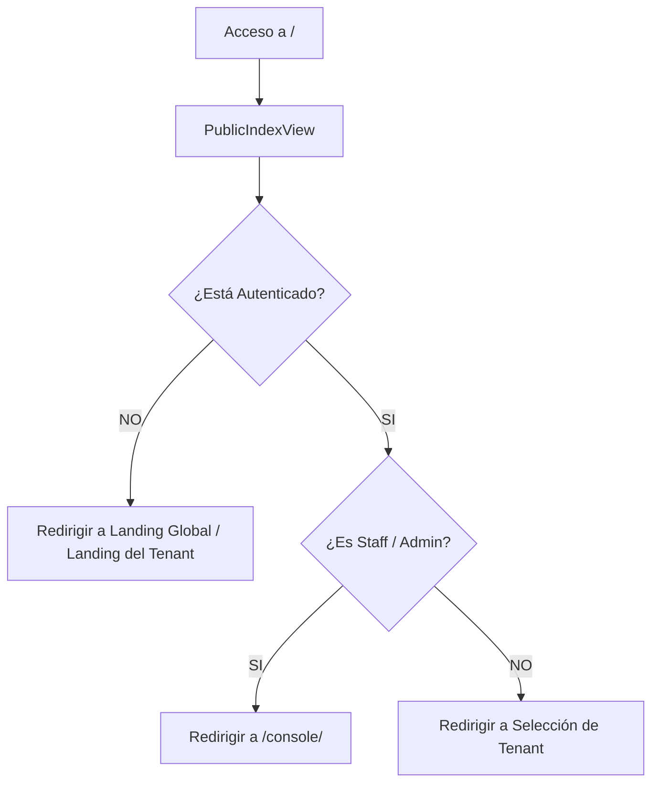

# 🗺️ Mapa de Flujo: Módulo Core Public (SSoT)

Este documento define la secuencia operativa para los servicios transversales globales.

---

## 1. Ciclo de Envío de Email Transaccional

---

## 2. Resolución de Entrada (Redirección Inteligente)

---

## 3. Validación de Token con Auditoría

- **Flujo**: El frontend envía el token a `/api/v1/core/token/verify/`.
- **Proceso**:
    1. Validar firma del token (SimpleJWT).
    2. Si es válido, registrar acceso en `ConsoleActionLog` (opcional).
    3. Retornar metadatos del usuario (nombre, rol global).
