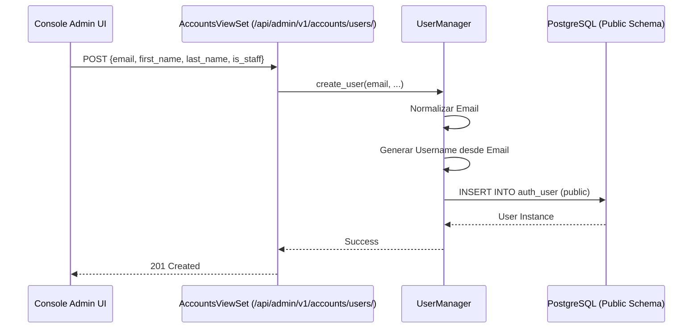

# 🗺️ Mapa de Flujo: Módulo Accounts (SSoT)

Este documento define la secuencia operativa para la gestión de usuarios globales.

---

## 1. Ciclo de Creación de Usuario (Admin)



---

## 2. Orquestación de Eliminación (Cross-Schema Cleanup)

```mermaid
graph TD
    A[Request DELETE /users/{id}/] --> B[DeleteUserService.execute]
    B --> C[Identificar Tenants donde el usuario tiene membresía]
    C --> D[Iterar Tenants]
    D --> E[Borrar TenantProfile en Esquema Tenant]
    E --> F[Continuar con el siguiente Tenant]
    F --> G[Borrar User en Esquema Public]
    G --> H[Registrar en DeletionAudit]
    H --> I[Response 204 No Content]
```

---

## 3. Resolución de Username SINTEL

- **Algoritmo**: `email.split('@')[0]` + normalización de caracteres especiales.
- **Unicidad**: Validada antes de la inserción. Si hay colisión, se añade un sufijo numérico incremental.
- **SSoT**: El `username` es un artefacto técnico; el `email` es el identificador primario para el login.
