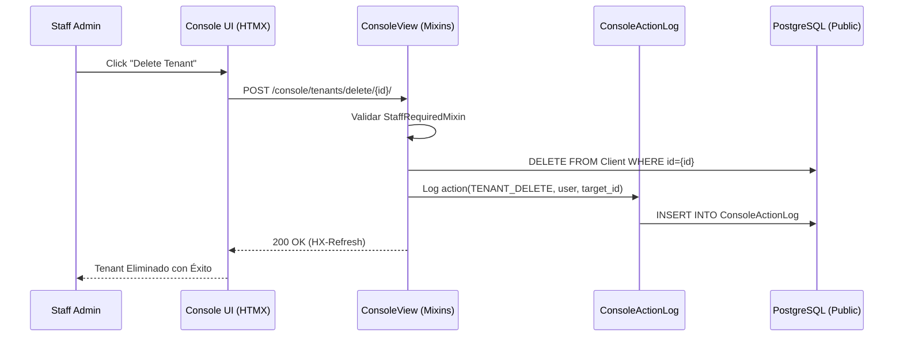

# 🗺️ Mapa de Flujo: Módulo Console (SSoT)

Este documento define la secuencia operativa para la gestión administrativa global.

---

## 1. Ciclo de Auditoría de Acciones



---

## 2. Resolución de Dashboard Administrativo

```mermaid
graph TD
    A[GET /console/] --> B[DashboardView]
    B --> C[StatsProvider.get_summary]
    C --> D[Count Tenants Activos]
    C --> E[Count Usuarios Globales]
    C --> F[Check FailedTasks (DLQ)]
    D & E & F --> G[Render index.html (Bootstrap 5)]
```

---

## 3. Navegación Basada en HTMX (SPA-Lite)

- **Root**: `/console/` sirve el esqueleto de la aplicación.
- **Dynamic Swaps**: Los clics en la barra lateral disparan `hx-get` hacia fragmentos HTML (tenants, usuarios, impuestos).
- **Feedback**: Las operaciones exitosas emiten `HX-Trigger` para actualizar contadores globales en el header.
