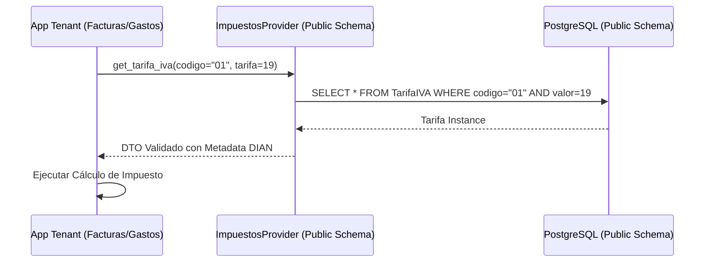
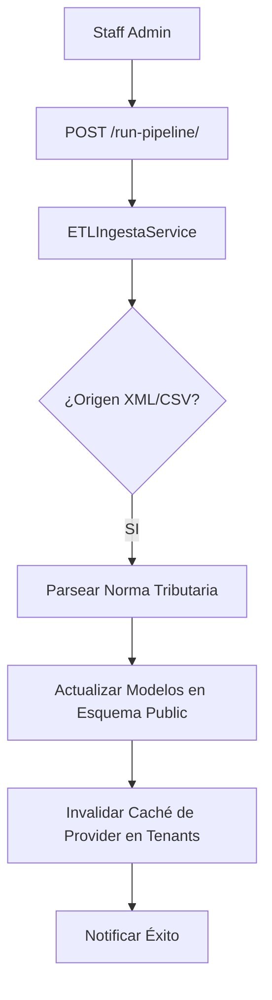

# 🗺️ Mapa de Flujo: Módulo Impuestos (SSoT)

Este documento define la secuencia operativa para la provisión del catálogo tributario.

---

## 1. Ciclo de Consumo desde Tenant (Cross-Schema)

---

## 2. Pipeline de Actualización Legal (ETL)

---

## 3. Resolución de Perfil Tributario

- **Entrada**: Datos del RUT del cliente/proveedor.
- **Proceso**: El `ImpuestosProvider` cruza Responsabilidades RUT + Régimen para determinar el tratamiento fiscal (¿Es retenedor?, ¿Es responsable de IVA?).
- **Salida**: Matriz de impuestos aplicables para la transacción.
