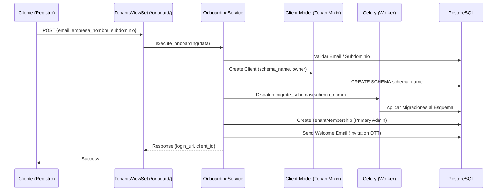
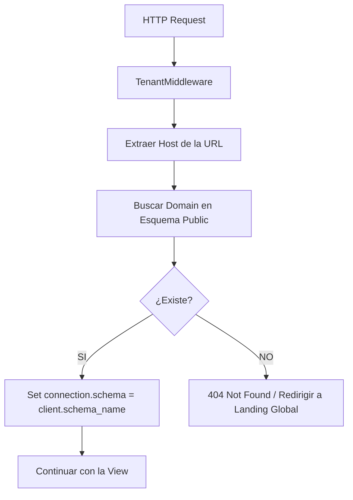

# 🗺️ Mapa de Flujo: Módulo Tenants (SSoT)

Este documento define la secuencia operativa para la gestión de inquilinos y esquemas.

---

## 1. Pipeline de Onboarding (E2E)

---

## 2. Resolución de Esquema por Petición (Middleware)

---

## 3. Manejo de Errores de Infraestructura (DLQ)

- **FailedTenantTask**: Si la tarea Celery de migración o seeding falla, el registro se guarda con el `traceback` y el payload original.
- **Reintento**: Los administradores pueden relanzar la tarea desde la Consola Central tras corregir la causa raíz.
