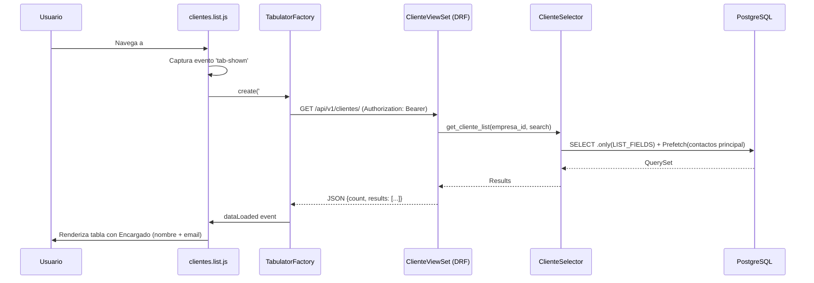
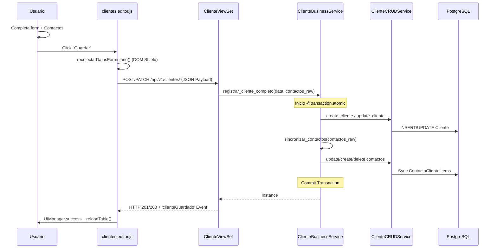
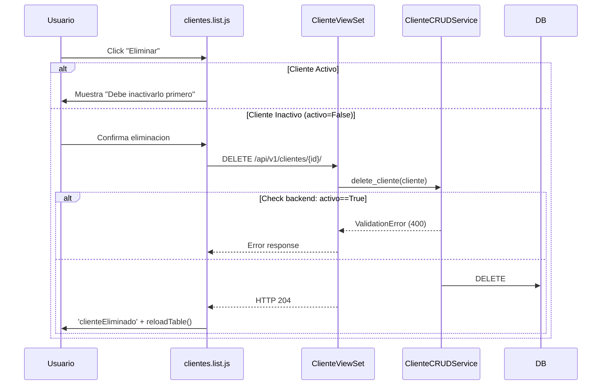
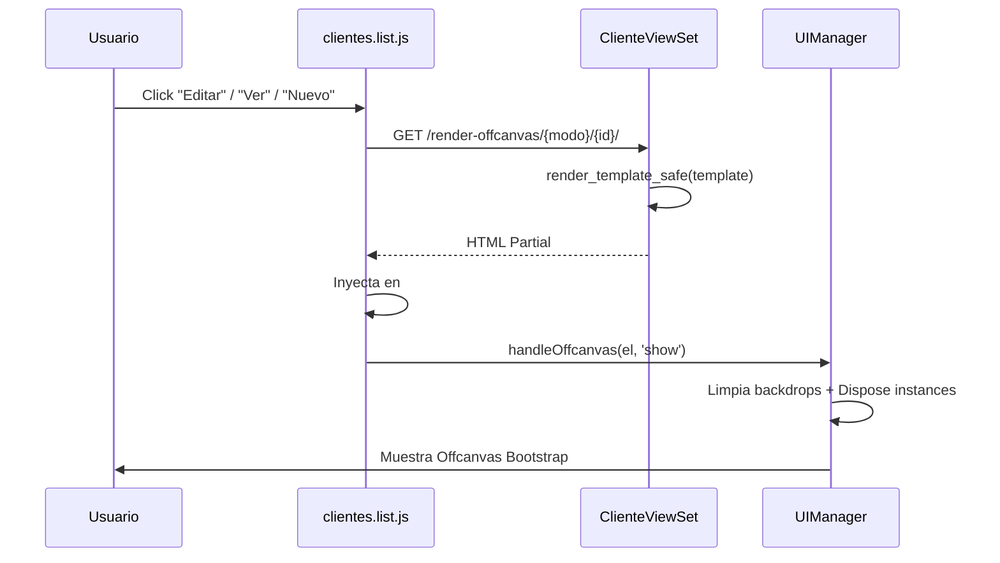
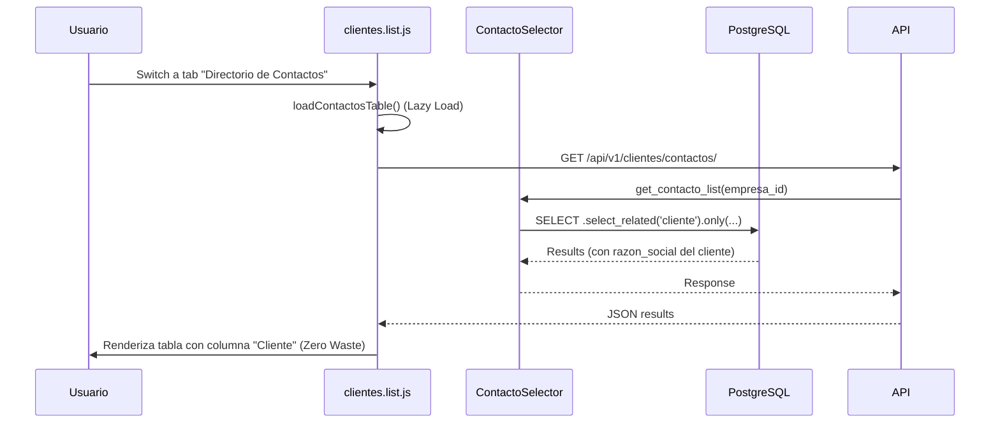

# CLIENTES — Flow Map (Mapa de Flujos)

**Version:** 3.5.0
**App:** `apps/tenant/clientes/`

Este documento detalla los flujos de datos y secuencias de operacion del modulo de Clientes, desde la interaccion en el frontend hasta la persistencia en base de datos.

---

## 1. Renderizado de Grilla Principal (Tabulator)

---

## 2. Flujo CRUD Maestro-Detalle (Crear/Editar)

---

## 3. Eliminacion con Doble Validacion (Two-Step Delete)

---

## 4. Renderizado de Offcanvas (HTMX)

---

## 5. Trazabilidad de Contactos (Directorio Global)

