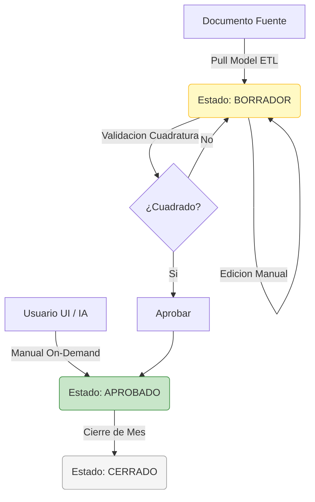
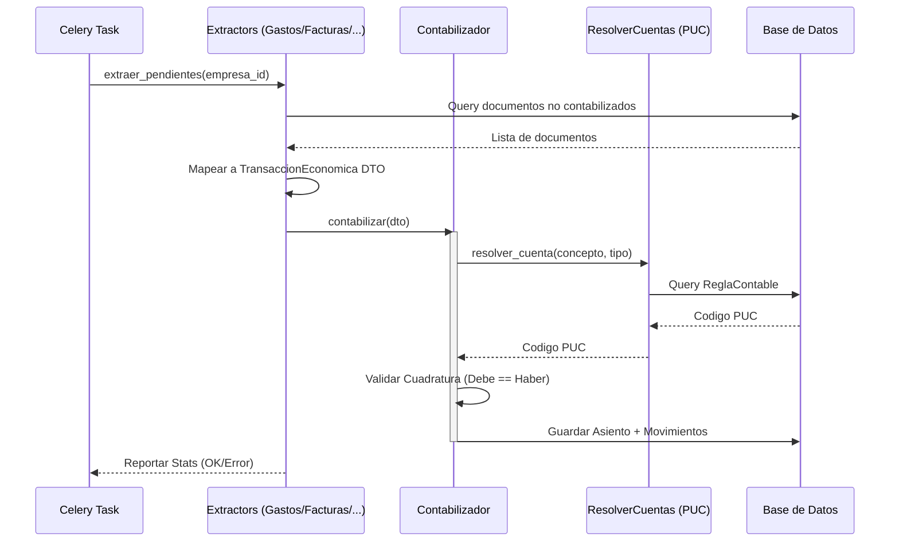
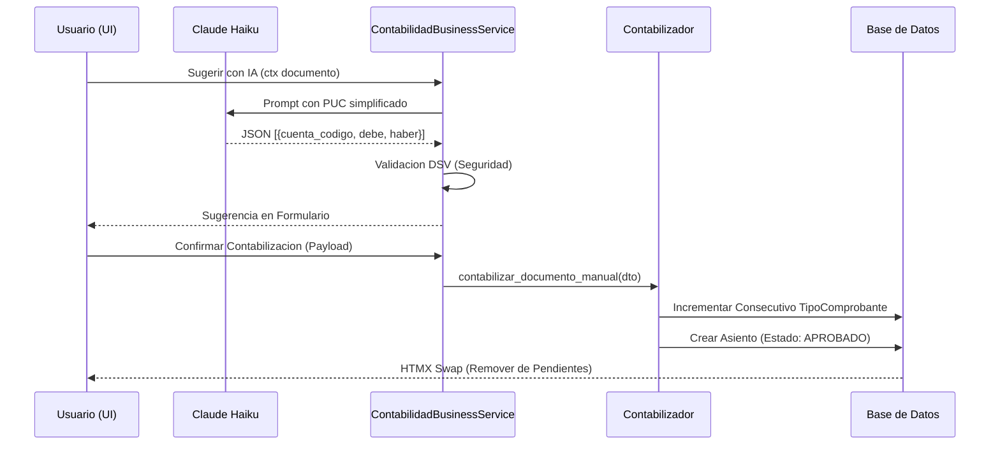
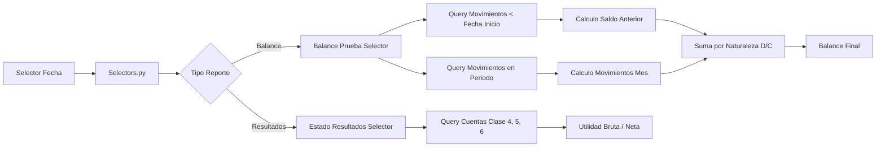

# CONTABILIDAD — Mapa de Flujos

**Version:** 3.5.0
**App:** `apps/tenant/contabilidad/`

---

## 1. Ciclo de Vida del Asiento Contable

El sistema maneja dos caminos de entrada (Pull vs Manual) y un ciclo de vida basado en estados inmutables.

---

## 2. Flujo Pull Model (ETL Automático)

Este flujo es orquestado por Celery y procesa documentos de forma masiva e idempotente.

---

## 3. Flujo Manual On-Demand (Asistente IA)

Contabilización manual desde la lista de pendientes con soporte de IA.

---

## 4. Flujo de Reportes Financieros

Generación de Balance de Prueba y Estado de Resultados.

