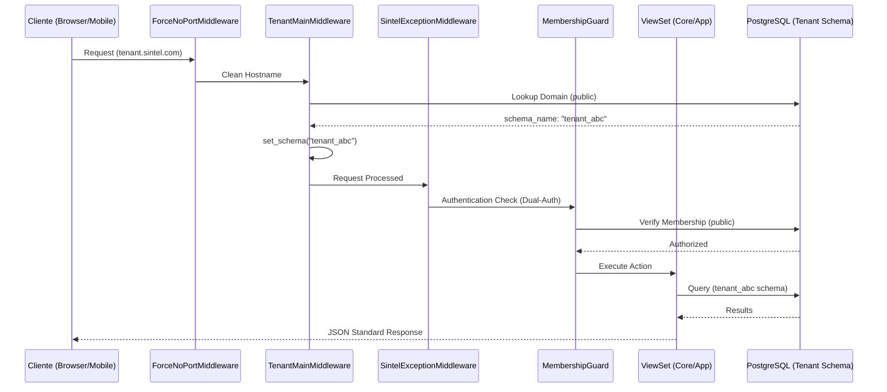
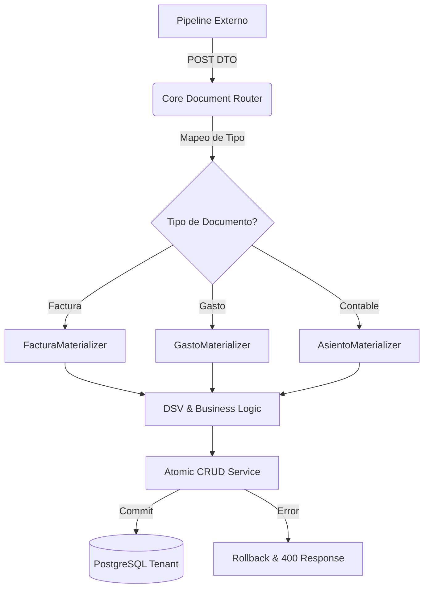
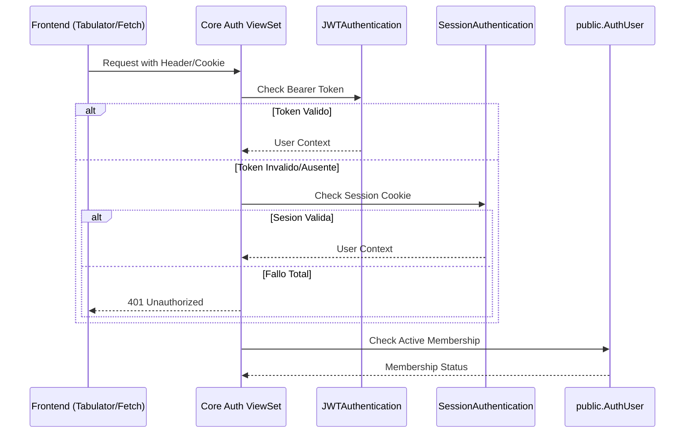

# CORE — Mapa de Flujos y Secuencias

**Version:** 3.5.0
**App:** `apps/tenant/core/`

---

## 📂 Navegación de Documentación
- [🏗️ Arquitectura de Microtareas](core_microtasks_architecture.md)
- [⚖️ Lógica de Negocio y Reglas SSoT](core_business_logic.md)
- [🏠 Portal de Auditoría](../AUDITORIA_FLUJO_CORE.md)

---

## 1. Ciclo de Vida de una Petición (Middleware Chain)

Este flujo describe cómo viaja una petición desde el host hasta el ViewSet, asegurando el aislamiento del tenant.

## 2. Pipeline de Ingesta Universal (`document_router`)

Flujo de materialización de documentos (facturas, gastos, etc.) desde fuentes externas.

## 3. Resolución de Identidad y Dual-Auth

---
**Última actualización:** 2026-05-09
