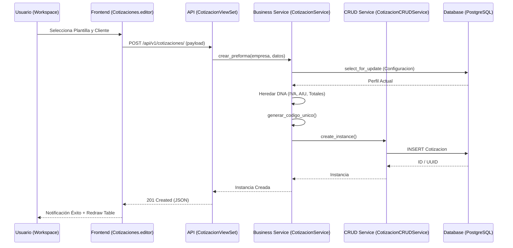
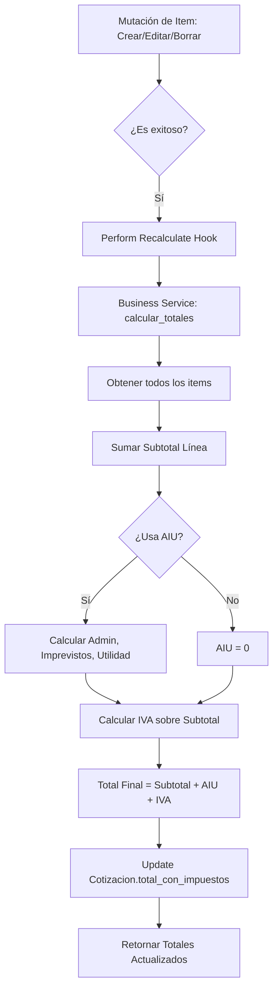
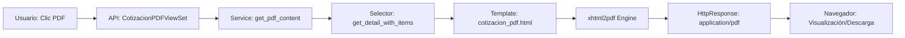

# 🗺️ Mapas de Flujo: Módulo Cotizaciones

Este documento visualiza los procesos críticos del módulo de cotizaciones, desde la interacción del usuario hasta la persistencia y exportación.

---

## 🔄 Ciclo de Vida de una Cotización

El siguiente diagrama detalla el flujo de creación de una cotización, destacando la herencia de DNA desde la plantilla.

---

## 📥 Ingesta de Items y Recálculo de Totales

El recálculo de totales es una operación SSoT que se dispara automáticamente ante cualquier mutación de items.

---

## 📄 Pipeline de Generación de PDF

Proceso sincrónico de exportación de documentos comerciales.

---

## 🔗 Navegación
- [⬅️ Volver al Portal](file:///c:/Users/Administrator/Documents/crm_sintel/apps/tenant/cotizaciones/AUDITORIA_FLUJO_COMPLETO.md)
- [📂 Arquitectura y Microtareas](file:///c:/Users/Administrator/Documents/crm_sintel/apps/tenant/cotizaciones/docs/cotizaciones_microtasks_architecture.md)
- [🧠 Lógica de Negocio](file:///c:/Users/Administrator/Documents/crm_sintel/apps/tenant/cotizaciones/docs/cotizaciones_business_logic.md)
