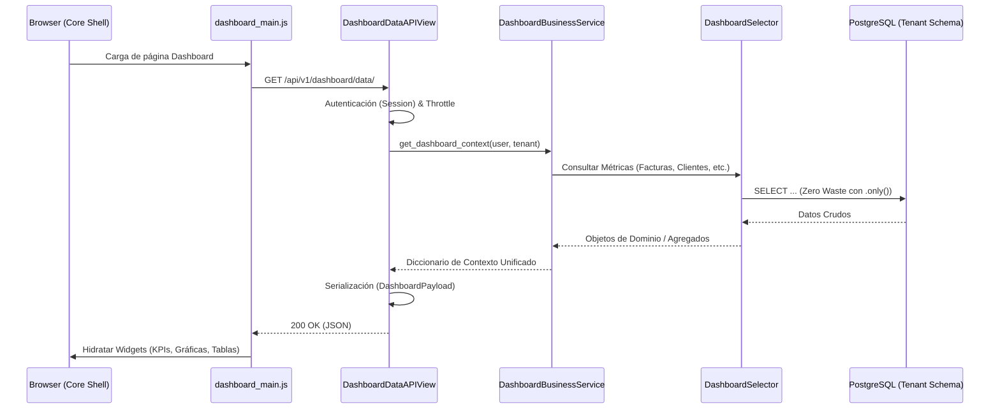

# 🗺️ Mapas de Flujo: Módulo Dashboard

Este documento visualiza los procesos de agregación y entrega de datos del dashboard.

---

## 🔄 Ciclo de Vida de la Petición (API-First)

El dashboard opera bajo un modelo de hidratación reactiva. El frontend solicita el estado completo del negocio mediante un único punto de entrada.

---

## 🏗️ Desglose Funcional

### 1. Puente de Autenticación
- La página del dashboard es servida como un asset estático por el módulo `core`.
- Al cargar, utiliza `window.jwtAuth` o `SessionAuthentication` para autorizar las llamadas a la API de datos.

### 2. Enrutamiento por Rol
- `get_dashboard_redirect_url` determina si el usuario debe aterrizar en una vista de Administrador, Staff o Visor.
- El frontend ajusta dinámicamente las "Acciones Rápidas" visibles basadas en el atributo `user_role` del payload.

### 3. Integridad de Datos
- Todas las consultas están estrictamente aisladas por `empresa_id` (Tenant isolation).
- Se proporcionan valores por defecto (0 o vacíos) si los módulos de dominio (ej. `facturas`) aún no contienen datos.

---

## 🔗 Navegación
- [⬅️ Volver al Portal](file:///c:/Users/Administrator/Documents/crm_sintel/apps/tenant/dashboard/AUDITORIA_FLUJO_DASHBOARD.md)
- [📂 Arquitectura y Microtareas](file:///c:/Users/Administrator/Documents/crm_sintel/apps/tenant/dashboard/docs/dashboard_microtasks_architecture.md)
- [🧠 Lógica de Negocio](file:///c:/Users/Administrator/Documents/crm_sintel/apps/tenant/dashboard/docs/dashboard_business_logic.md)
