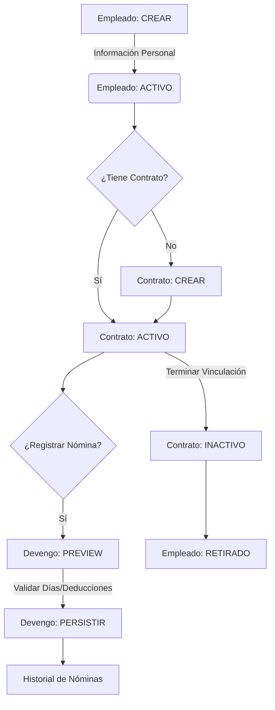
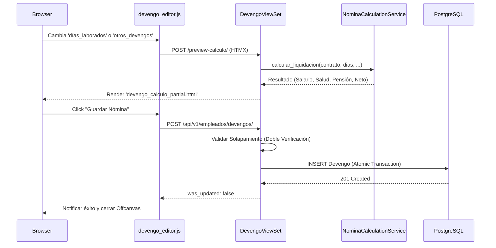

# 🗺️ Mapas de Flujo: Módulo Empleados

Este documento detalla los procesos secuenciales y la sincronización de datos en el ciclo de vida del empleado.

---

## 🔄 Ciclo de Vida Laboral (Máquina de Estados)

El flujo es estrictamente secuencial para garantizar la integridad de los datos financieros.

---

## 💸 Flujo de Registro de Nómina (API + HTMX)

Proceso de cálculo en tiempo real sin persistencia hasta la confirmación final.

---

## 🛡️ Aislamiento Zero Trust en Empleados

Cada petición valida la identidad del tenant antes de cualquier operación.

- **DSV (Double Semantic Verification)**:
    1.  Verificación de `empresa_id` en el objeto principal (Empleado).
    2.  Verificación de `empresa_id` en todas las entidades relacionadas (Contrato, Empresa).

---

## 🔗 Navegación
- [⬅️ Volver al Portal](file:///c:/Users/Administrator/Documents/crm_sintel/apps/tenant/empleados/AUDITORIA_FLUJO_EMPLEADOS.md)
- [📂 Arquitectura y Microtareas](file:///c:/Users/Administrator/Documents/crm_sintel/apps/tenant/empleados/docs/empleados_microtasks_architecture.md)
- [🧠 Lógica de Negocio](file:///c:/Users/Administrator/Documents/crm_sintel/apps/tenant/empleados/docs/empleados_business_logic.md)
