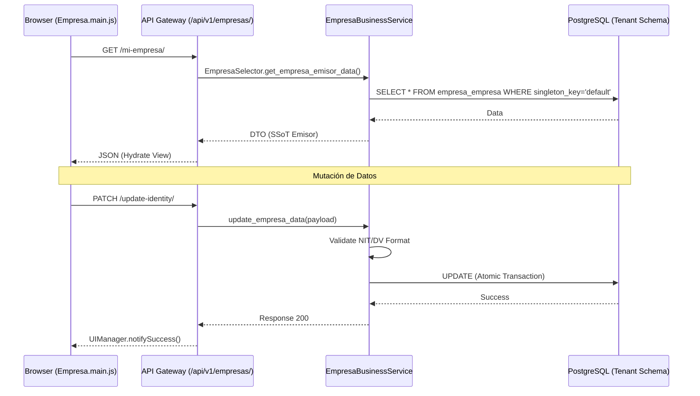
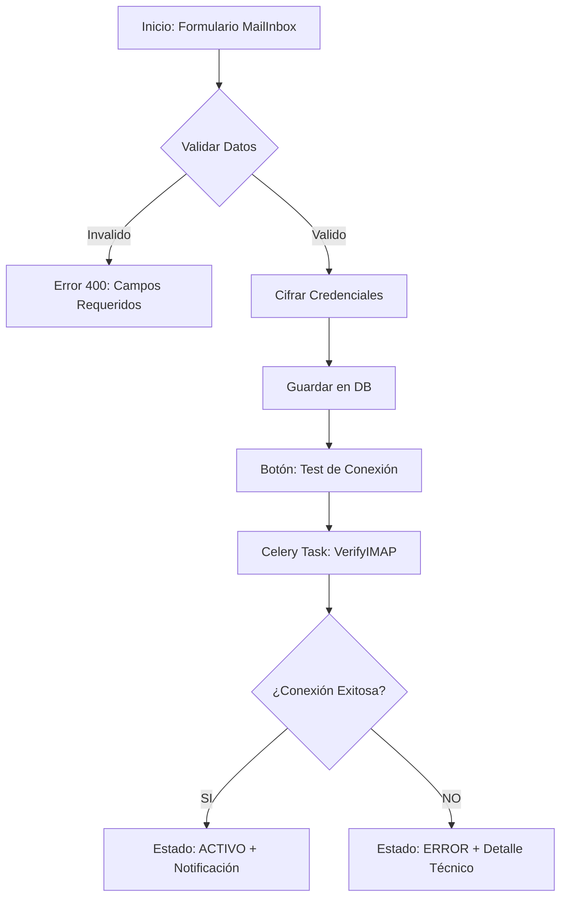
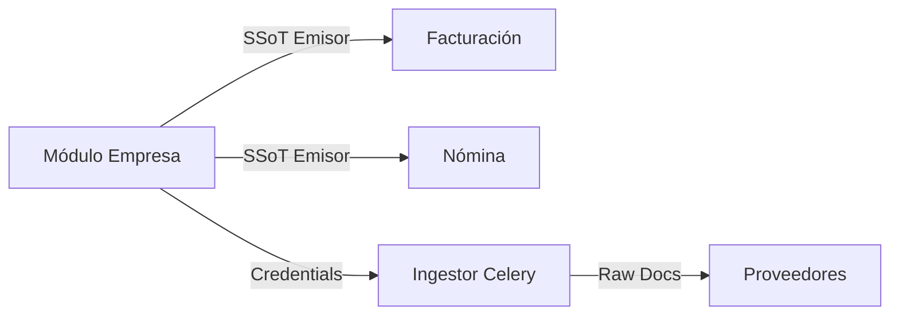

# 🗺️ Mapa de Flujo: Módulo Empresa (SSoT)

Este documento define la secuencia operativa del Módulo de Empresa, desde la identidad básica hasta la integración técnica de ingesta.

---

## 1. Ciclo de Vida: Identidad y Singleton

El sistema garantiza que cada tenant tenga exactamente una identidad corporativa configurada.

---

## 2. Flujo de Configuración MailInbox (Ingesta)

Configuración técnica para la captura automática de documentos externos.

---

## 3. Consumo Cross-Module (SSoT)

Cómo otros módulos consumen la información de la empresa.

---

## 4. Estructura de Navegación UI

- **Dashboard Principal**: Tarjeta de resumen de identidad.
- **Configuración (Offcanvas)**:
  - Tab 1: Datos Legales (NIT, Razón Social).
  - Tab 2: Ubicación y Contacto.
  - Tab 3: Configuración MailInbox.
  - Tab 4: Logos y Marca.
