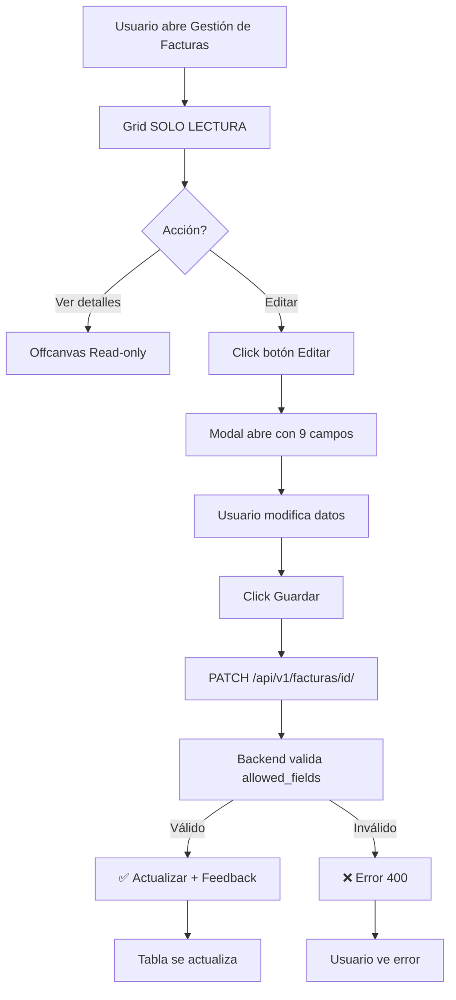

# 📦 Documentación Módulo Facturas (v2.97)

**Última Actualización:** 2026-05-11  
**Version:** 3.5.0 (API/Backend) | v2.97 (UI/UX)  
**Status:** ✅ PRODUCTION READY

---

## 🚀 Inicio Rápido

| Necesitas... | Ve a... |
|---|---|
| 📋 **Estado actual de la app** | [ESTADO_ACTUAL_v297.md](ESTADO_ACTUAL_v297.md) ⭐ |
| 🔒 **Cómo funciona la seguridad de edición** | [GARANTIA_EDICION_CONTROLADA.md](GARANTIA_EDICION_CONTROLADA.md) |
| 🏗️ **Arquitectura completa del módulo** | [AUDITORIA_FLUJO_FACTURAS.md](AUDITORIA_FLUJO_FACTURAS.md) |
| 🗺️ **Diagramas de flujo (Mermaid)** | [docs/facturas_flow_map.md](docs/facturas_flow_map.md) |
| 🧠 **Reglas de negocio y validaciones** | [docs/facturas_business_logic.md](docs/facturas_business_logic.md) |
| 📂 **Microtareas y responsabilidades** | [docs/facturas_microtasks_architecture.md](docs/facturas_microtasks_architecture.md) |

---

## ✅ Últimos Cambios (Sprint Actual)

### 🎯 Cambios Implementados (v2.97 - 2026-05-11)

#### 1. ✨ Estado de Pago
- Nuevo campo `estado_pago` para rastrear pagos
- Opciones: NO_PAGADA, PAGO_PARCIAL, PAGADA
- Default: NO_PAGADA
- Validado en 6 capas (UI → Backend → DB)

#### 2. 🔐 Edición Centralizada
- Grid: **100% SOLO LECTURA** (sin editores inline)
- Modal: Único lugar para editar facturas
- 9 campos permitidos para edición
- Garantía: XML fields protegidos en todas las capas

#### 3. 👁️ Contexto Visual
- Emisor visible en modal (pero no editable)
- Ayuda al usuario a identificar para quién edita

**Documentación detallada:** [ESTADO_ACTUAL_v297.md](ESTADO_ACTUAL_v297.md)

---

## 🛠️ Stack Tecnológico

```
Backend
├─ Django DRF (REST API)
├─ Celery (Async ingestion)
├─ PostgreSQL Multi-tenant (django-tenants)
└─ UBL 2.1 Parser (XML extraction)

Frontend
├─ Vanilla JS ES6+ (No framework)
├─ Tabulator.js (Grid/tabla)
├─ Bootstrap 5.3.2 (UI components)
├─ HTMX (Server-driven fragments)
└─ Namespace: window.Sintel.Facturas

Storage
├─ PostgreSQL (Datos, snapshots)
└─ FacturaAnexos (XMLs, ApplicationResponses)
```

---

## 📊 Estructura de Datos

### Modelo Principal: Factura

**Campos de Lectura (XML):**
- número, prefijo, consecutivo, tipo
- fecha_emision, naturaleza, categoría
- emisor_*, receptor_* (snapshots)
- moneda, subtotal, impuestos, total
- cufe, qr_url

**Campos Editables (Manual):**
```python
estado              # BORRADOR, ENVIADA, ACEPTADA, RECHAZADA, ANULADA
estado_pago         # NO_PAGADA, PAGO_PARCIAL, PAGADA ⭐
fecha_vencimiento   # Fecha
retefuente          # Decimal
reteica             # Decimal
reteiva             # Decimal
forma_pago          # String
medio_pago_codigo   # String
payment_due_date    # Fecha
```

---

## 🔒 Garantía de Seguridad

### Flujo de Validación (6 Capas)

```
1. Frontend (UI)
   └─ Grid sin editores + Modal con 9 campos

2. Frontend (Network)
   └─ PATCH envía solo allowed_fields

3. Backend (ViewSet)
   └─ Valida contra allowed_fields whitelist

4. Backend (Serializer)
   └─ FacturaWriteSerializer valida tipos

5. Backend (ORM)
   └─ Modelo protege campos XML

6. Database
   └─ Integridad referencial
```

**Resultado:** Imposible editar campos XML desde cualquier vector

---

## 📁 Rutas Principales

**API Endpoints:**
- `GET /api/v1/facturas/` - Listar (read-only)
- `PATCH /api/v1/facturas/{id}/` - Editar (9 campos)
- `POST /api/v1/facturas/upload-ubl/` - Importar XML

**Frontend:**
- `static/js/facturas/` - Módulos JS
  - `facturas.api.js` - SSoT URLs
  - `facturas_list.js` - Grid + Modal
  - `facturas_main.js` - Orquestador

**Templates:**
- `templates/tenant/facturas/` - HTML
  - `list.html` - Contenedor principal
  - `offcanvas_*.html` - Modales dinámicos

---

## 🎯 Flujo de Edición (v2.97)



---

## 🧪 Testing

### Test Básico (UI)
1. Abre Gestión de Facturas
2. Intenta click en celda → Sin efecto ✅
3. Click botón "Editar"
4. Cambia "Estado de Pago" a "Pagada"
5. Click "Guardar" → Actualiza ✅

### Test Seguridad (API)
```bash
# Válido
curl -X PATCH /api/v1/facturas/2/ \
  -H "Content-Type: application/json" \
  -d '{"estado_pago": "PAGADA"}'
→ 200 OK ✅

# Inválido (campo no permitido)
curl -X PATCH /api/v1/facturas/2/ \
  -H "Content-Type: application/json" \
  -d '{"numero": "HACK"}'
→ 400 Bad Request ❌
```

---

## 📚 Documentos de Referencia

### Documentación Técnica
- **[ESTADO_ACTUAL_v297.md](ESTADO_ACTUAL_v297.md)** - Estado completo de la app ⭐
- **[GARANTIA_EDICION_CONTROLADA.md](GARANTIA_EDICION_CONTROLADA.md)** - Detalles de seguridad
- **[AUDITORIA_FLUJO_FACTURAS.md](AUDITORIA_FLUJO_FACTURAS.md)** - Auditoría general

### Mapas de Flujo
- **[docs/facturas_flow_map.md](docs/facturas_flow_map.md)** - Diagramas Mermaid

### Lógica de Negocio
- **[docs/facturas_business_logic.md](docs/facturas_business_logic.md)** - Reglas y validaciones
- **[docs/facturas_microtasks_architecture.md](docs/facturas_microtasks_architecture.md)** - Microtareas

---

## ❓ Preguntas Frecuentes

**P: ¿Se pueden editar campos del XML después de importar?**  
R: No. Los campos XML (número, emisor, totales, etc.) están 100% protegidos. Solo 9 campos manuales son editables.

**P: ¿Dónde se editan las facturas?**  
R: Solo en el modal "Editar Factura" que se abre con el botón "Editar" (lápiz). El grid es 100% lectura.

**P: ¿Cuál es el nuevo campo "Estado de Pago"?**  
R: Campo para marcar si el cliente pagó (NO_PAGADA, PAGO_PARCIAL, PAGADA). Ayuda a contabilidad y cobranza.

**P: ¿Cómo se valida la edición?**  
R: En 6 capas: UI, Network, ViewSet, Serializer, ORM, Database. Imposible bypass.

**P: ¿Puedo editar el Emisor?**  
R: No. El Emisor se muestra en el modal solo para contexto, pero está deshabilitado.

---

## 🤝 Contribución

Para cambios en este módulo:
1. Lee [ESTADO_ACTUAL_v297.md](ESTADO_ACTUAL_v297.md)
2. Revisa [GARANTIA_EDICION_CONTROLADA.md](GARANTIA_EDICION_CONTROLADA.md)
3. Consulta [docs/facturas_business_logic.md](docs/facturas_business_logic.md)
4. Presenta tu cambio respetando las 9 campos editables permitidos

---

**Last Updated:** 2026-05-11  
**Maintained by:** SINTEL Dev Team  
**License:** Internal Use Only
