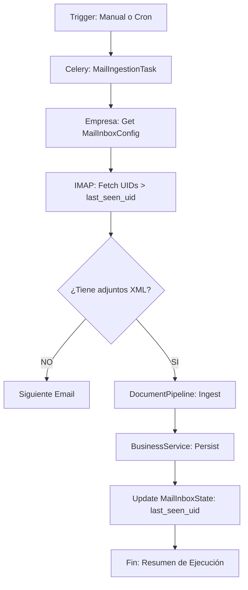

# 🗺️ Mapa de Flujo: Módulo Facturas (SSoT)

Este documento define la arquitectura de los pipelines de datos para documentos electrónicos.

---

## 1. Pipeline de Importación XML (Sincrónico/Asincrónico)

```mermaid
sequenceDiagram
    participant UI as Browser (Drag & Drop)
    participant API as FacturaViewSet (upload-ubl)
    participant PIP as DocumentPipeline (Universal)
    participant PAR as UBLParser
    participant SRV as FacturaBusinessService
    participant DB as PostgreSQL

    UI->>API: POST File (XML)
    API->>PIP: ingest_document(bytes)
    PIP->>PAR: extract_dto()
    PAR-->>PIP: InvoiceDTO
    PIP-->>API: DTO Canónico
    API->>SRV: guardar_factura_desde_dto(DTO)
    SRV->>DB: Check CUFE (Idempotencia)
    alt Nuevo CUFE
        SRV->>DB: INSERT Factura + Items + Anexos
        DB-->>SRV: ID
        SRV-->>API: 201 Created (persisted:true)
    else CUFE Existe (Duplicate)
        SRV->>DB: UPDATE Anexos (Silent Success)
        SRV-->>API: 200 OK (persisted:true)
    end
    API-->>UI: UIManager.notifySuccess()
```

---

## 2. Pipeline de Ingesta por Correo (IMAP Sync)



---

## 3. Ciclo de Vida de Nota Crédito


---

## 4. Estructura de Navegación UI (FSD)

- **Listado (`list_factura.html`)**: Grilla Tabulator con filtros por naturaleza y estado.
- **Detalle (`offcanvas_detalle_factura.html`)**: Visualización de ítems, totales y visor de XML/PDF.
- **Importador (`offcanvas_importar_factura.html`)**: Área de carga masiva con feedback de progreso en tiempo real.
- **Sync Status (`offcanvas_pendientes_factura.html`)**: Monitor de tareas Celery de ingesta por correo.
