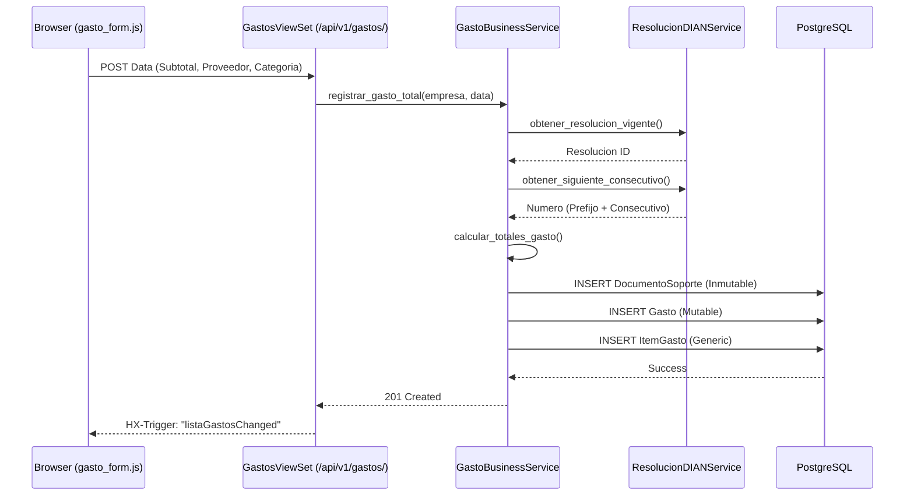
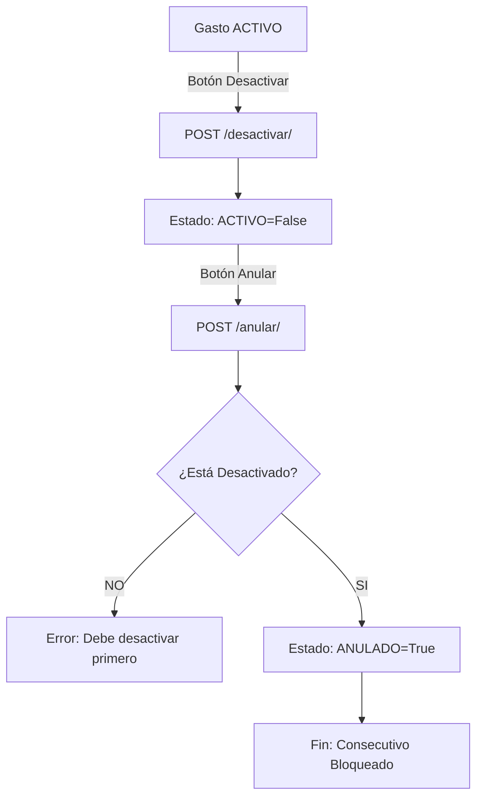

# 🗺️ Mapa de Flujo: Módulo Gastos (SSoT)

Este documento define la secuencia operativa para el registro de egresos y documentos soporte.

---

## 1. Creación de Documento Soporte y Gasto

---

## 2. Ciclo de Vida: Desactivación y Anulación

---

## 3. Gestión de Resoluciones DIAN

---

## 4. Estructura de Navegación UI (FSD)

- **Panel de Control**: Resumen financiero y botones de acción rápida.
- **Grilla de Gastos**: Listado con Tabulator (Filtros por fecha, proveedor y estado).
- **Grilla de Resoluciones**: Gestión de rangos DIAN.
- **Editor Offcanvas**:
  - `Formulario Gasto`: Captura simplificada de subtotal y retenciones.
  - `Formulario Resolución`: Configuración de prefijos y rangos legales.
