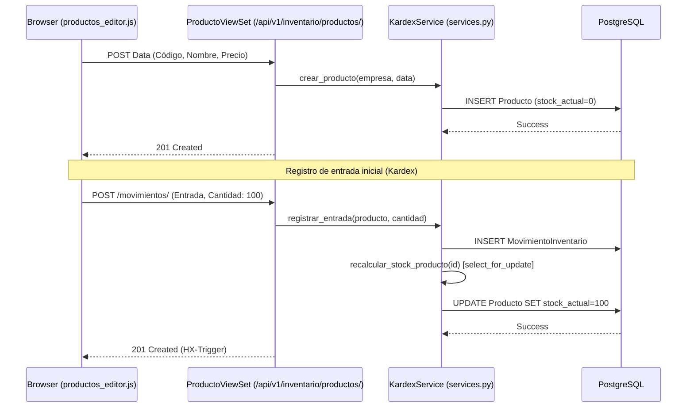
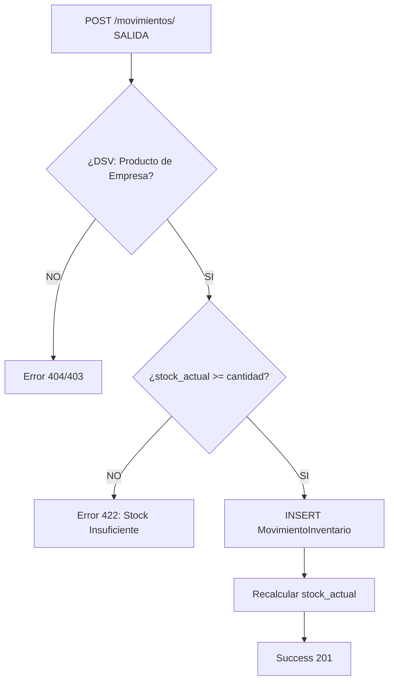
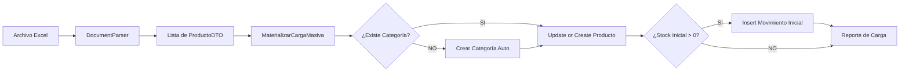

# 🗺️ Mapa de Flujo: Módulo Inventario (SSoT)

Este documento define la secuencia operativa para la gestión de ítems y control de existencias.

---

## 1. Ciclo de Vida: Registro y Movimiento de Producto

---

## 2. Validación de Stock en Salidas

---

## 3. Proceso de Carga Masiva (Excel)

---

## 4. Estructura de Navegación UI (FSD)

- **Inventario Dashboard**: Pestañas para Productos, Servicios, Activos y Movimientos.
- **Grilla Tabulator**: Carga bajo demanda de ítems con alertas visuales de stock bajo.
- **Editores Offcanvas**: Formularios específicos para cada tipo de ítem.
- **Kardex Modal**: Vista cronológica del historial de un producto específico.
