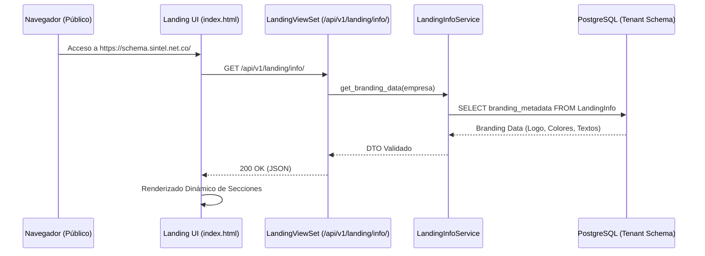
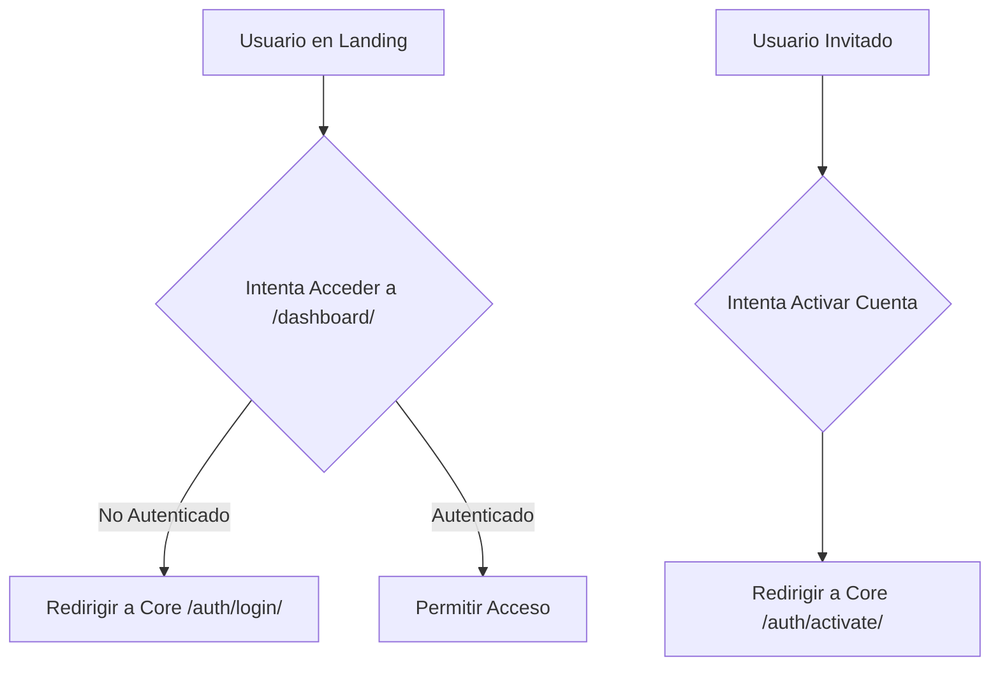

# 🗺️ Mapa de Flujo: Módulo Landing (SSoT)

Este documento define la secuencia operativa para la fachada pública del tenant.

---

## 1. Ciclo de Carga de Landing Page



---

## 2. Resolución de Branding Cross-App

```mermaid
graph TD
    A[Cualquier Módulo (Core/Ventas/etc)] --> B{¿Necesita Logo/Colores?}
    B -- SI --> C[GET /api/v1/landing/branding/]
    C --> D[LandingInfoService]
    D --> E[Cache de Branding (Redis/Session)]
    E --> F[Retornar Estilos Corporativos]
    F --> G[Inyectar CSS Variables en el DOM]
```

---

## 3. Redirección de Flujos Protegidos (Aislamiento)


