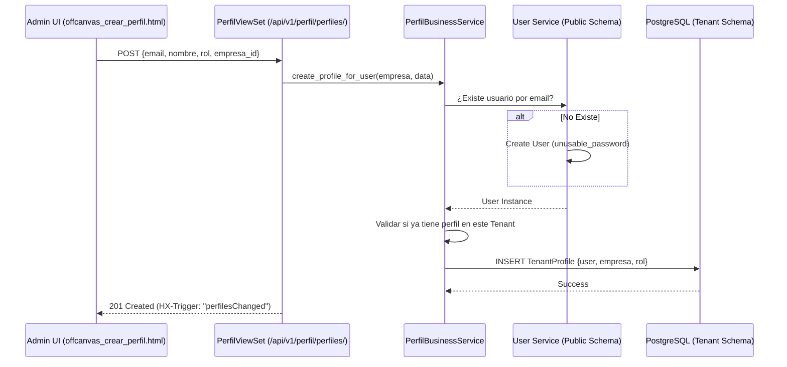
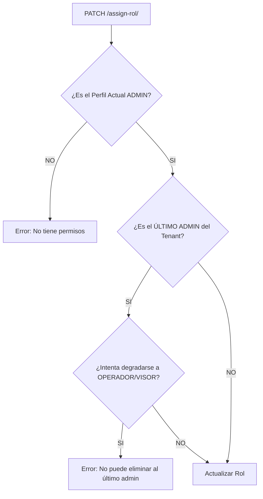

# 🗺️ Mapa de Flujo: Módulo Perfil (SSoT)

Este documento define la secuencia operativa para la gestión de acceso e identidad.

---

## 1. Flujo de Invitación: Usuario Nuevo -> Perfil Tenant



---

## 2. Resolución de Perfil Actual (`/me/`)

```mermaid
graph TD
    A[GET /perfiles/me/] --> B[Obtener User de la Sesión/JWT]
    B --> C[Buscar TenantProfile(user, empresa_actual)]
    C --> D{¿Es owner_email de la Empresa?}
    D -- SI --> E[Garantizar Rol ADMIN]
    D -- NO --> F[Retornar Rol Actual]
    E --> G[Update Profile si es necesario]
    F --> H[Response 200 JSON]
    G --> H
```

---

## 3. Protección de Integridad en Cambio de Roles



---

## 4. Estructura de Navegación UI (FSD)

- **User Management**: Tabla Tabulator con listado de colaboradores y sus roles.
- **Detalle de Perfil**: Vista de solo lectura para el administrador.
- **Editor de Perfil Propio**: Sección especial para que el usuario actual actualice su avatar y preferencias.
- **Buscador Cross-Tenant**: (Opcional) Funcionalidad de administrador para invitar usuarios que ya existen en otros tenants de la plataforma.
