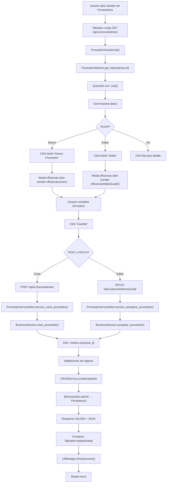

# 📦 Documentación Módulo Proveedores (v3.6.0)

**Última Actualización:** 2026-05-11  
**Versión:** 3.6.0 (Backend/API) | v3.6.0 (UI/UX Premium Redesign)  
**Status:** ✅ PRODUCTION READY (Formulario Reorganizado + Premium Layout)

---

## 🚀 Inicio Rápido

| Necesitas... | Ve a... |
|---|---|
| 📋 **Estado actual de la app** | [ESTADO_ACTUAL_v360.md](ESTADO_ACTUAL_v360.md) ⭐ |
| 🎨 **Layout premium del formulario** | [ESTADO_ACTUAL_v360.md](ESTADO_ACTUAL_v360.md#2️⃣-proveedores-v360-redesign-premium-del-formulario) |
| 🗑️ **Delete seguro (soft/hard delete)** | [DELETE_SEGURO_v360.md](DELETE_SEGURO_v360.md) ⭐ NUEVO |
| 🔒 **Cómo funciona la seguridad (DSV)** | [GARANTIA_SEGURIDAD_DSV.md](GARANTIA_SEGURIDAD_DSV.md) |
| 🏗️ **Arquitectura completa del módulo** | [AUDITORIA_FLUJO_PROVEEDORES.md](AUDITORIA_FLUJO_PROVEEDORES.md) |
| 🗺️ **Diagramas de flujo (Mermaid)** | [docs/proveedores_flow_map.md](docs/proveedores_flow_map.md) |
| 🧠 **Reglas de negocio y validaciones** | [docs/proveedores_business_logic.md](docs/proveedores_business_logic.md) |
| 📂 **Microtareas y responsabilidades** | [docs/proveedores_microtasks_architecture.md](docs/proveedores_microtasks_architecture.md) |

---

## ✅ Últimos Cambios (Sprint v3.6.0)

### 🗑️ Delete Seguro con Soft Delete Automático (NUEVO)

**Problema resuelto:** Error "Cannot delete some instances of model 'Proveedor'" cuando hay gastos/documentos soporte asociados.

**Solución:**
- Si el proveedor NO tiene referencias FK → Hard delete (eliminación física) ✅
- Si el proveedor SÍ tiene referencias FK → Soft delete automático (marca como inactivo) ✅
- En ambos casos: respuesta 204 No Content (usuario ve "eliminado" sin errores técnicos)
- Datos preservados: Los documentos soporte permanecen intactos y auditables

**Implementación:** `apps/tenant/proveedores/services/business_service.py` líneas 179-200

**Documentación detallada:** [DELETE_SEGURO_v360.md](DELETE_SEGURO_v360.md)

---

### 🎨 UI/UX Premium Redesign - Formulario Reorganizado

#### 1. ✨ Layout Premium Optimizado
- ✅ Distribución horizontal mejorada (col-md ratios equilibrados)
- ✅ Headers de sección con badges de color + icono
- ✅ Labels `fw-semibold` + asteriscos rojos para campos requeridos
- ✅ Switches alineados perfectamente en fila única (flexbox)
- ✅ Panel de Retenciones visual con fondo `bg-success-subtle`

#### 2. 🐛 HTML Bugs Corregidos
- ✅ Tag `<div>` roto en sección Tributaria (nunca se cerraba)
- ✅ Estructura offcanvas ahora usa **flexbox** para footer fijo
- ✅ Body scrollea, footer `flex-shrink-0` siempre visible
- ✅ Validación HTML 100% conforme

#### 3. 📏 Distribución de Campos Optimizada
- ✅ Identificación: Tipo P (3) | Tipo Doc (3) | Número (4) | DV (2)
- ✅ Razón Social (7) | Comercial (5) — equilibrado
- ✅ Tributaria: Régi (4) | CIIU (4) | Contable (4)
- ✅ 4 switches: Responsable IVA (3) | Gran Contr. (3) | Auto. (3) | Agente Ret. (3)
- ✅ Retenciones: Retefuente (4) | ReteICA (4) | ReteIVA (4)
- ✅ Contacto: Email (5) | Tel (4) | Estado (3) + Dirección (8) | Ciudad (4)
- ✅ Bancaria: Plazo+días (2) | Banco (4) | Tipo (3) | Número (3)

**Documentación detallada:** [ESTADO_ACTUAL_v360.md](ESTADO_ACTUAL_v360.md) ⭐

---

## ✅ Histórico de Versiones

### v3.5.0 (Blocker Issues - COMPLETADO)
- UUID Lookup Field (AGENTS.md §14)
- Service Layer verificado
- Namespace JavaScript documentado

**Documentación:** [ESTADO_ACTUAL_v350.md](ESTADO_ACTUAL_v350.md)

### v3.6.0 (UI/UX Premium Redesign - ACTUAL)
- Layout premium reorganizado
- HTML bugs corregidos (footer fijo, tags rotos)
- Distribución horizontal optimizada
- CSS-ISOLATION compliant (AGENTS.md §22)

**Documentación:** [ESTADO_ACTUAL_v360.md](ESTADO_ACTUAL_v360.md)

---

## 🛠️ Stack Tecnológico

```
Backend
├─ Django DRF (REST API)
├─ django-tenants (Multi-tenant PostgreSQL)
└─ Service Layer (selectors + crud + business)

Frontend
├─ Vanilla JS ES6+ (Namespace: window.Sintel.Proveedores)
├─ Tabulator.js (Grid/tabla)
├─ Bootstrap 5.3.2 (UI components)
├─ HTMX (Server-driven fragments)
└─ HTMX-OOB (Out-of-Band updates)

Storage
├─ PostgreSQL (Datos, snapshots)
└─ SintelTenantBaseModel (empresa_id obligatorio)
```

---

## 📊 Estructura de Datos

### Modelo Principal: Proveedor

**Campos Lookup & Identificación:**
- `uuid`: UUIDField, unique=True (NUEVO - AGENTS.md §14) ⭐
- `tipo_documento`, `numero_documento`: SSoT de identificación
- Único por empresa: (empresa, tipo_documento, numero_documento)

**Campos de Contexto (Normativa Colombia):**
- `razon_social`: Nombre legal
- `regimen_tributario`: SIMPLE | ORDINARIO | NO_RESP
- `actividad_economica_ciiu`: Código CIIU
- `responsable_iva`, `gran_contribuyente`, `autoretenedor`: Flags

**Campos Comerciales:**
- `plazo_pago_dias`: Crédito estándar
- `banco`, `tipo_cuenta`, `numero_cuenta`: Bancarios

**Mapeo Contable:**
- `codigo_contable`: Subcuenta nivel-6 (Clase 2, Pasivos NIIF)

**Auditoría:**
- `empresa`: FK (SSoT, immutable)
- `created_at`, `updated_at`: Timestamps
- `activo`: Flag de estado

---

## 🔒 Garantía de Seguridad (AGENTS.md §13)

### Validación en 7 Capas

```
1. Frontend (UI)
   └─ Formulario HTMX sin editores inline

2. Network (HTTP)
   └─ POST/PATCH con campos permitidos

3. ViewSet (Enrutamiento)
   └─ IsTenantMember + resolve_tenant_empresa()

4. BusinessService (Lógica)
   └─ DSV (Double Semantic Verification)

5. Serializer (Validación de tipos)
   └─ ProveedorDetailSerializer

6. ORM (Modelo)
   └─ SintelTenantBaseModel + constraints

7. Database (Integridad)
   └─ UNIQUE + FK PROTECT
```

**Resultado:** Imposible acceder/editar datos de otro tenant

---

## 📁 Rutas Principales (AGENTS.md §6)

**API Endpoints:**
- `GET /api/v1/proveedores/` - Listar (read-only)
- `POST /api/v1/proveedores/` - Crear (con DSV)
- `PATCH /api/v1/proveedores/{uuid}/` - Editar (con DSV)
- `DELETE /api/v1/proveedores/{uuid}/` - Eliminar (con DSV)

**Frontend (FSD):**
- `templates/tenant/proveedores/` - Templates (prefijo tenant/)
- `static/proveedores/js/` - Scripts ES6+
  - `proveedores.api.js` - SSoT de URLs
  - `proveedores_main.js` - Orquestador Tabulator
  - `proveedores_form.js` - Gestión de formularios

**Documentación:**
- `.agent/` - Portal SSoT
- `docs/` - Flow maps, business logic, microtasks

---

## 🎯 Flujo de CRUD (v3.5.0)



---

## 🧪 Testing

### Test Básico (UI)
1. Abre Gestión de Proveedores
2. Click "Nuevo Proveedor"
3. Completa: tipo_documento, numero_documento, razon_social
4. Click "Guardar" → Proveedor creado ✅
5. Grid se actualiza automáticamente ✅

### Test Seguridad (API)
```bash
# Válido (usuario pertenece a empresa_id)
curl -X POST /api/v1/proveedores/ \
  -H "Authorization: Bearer {token}" \
  -H "Content-Type: application/json" \
  -d '{"tipo_documento": "NIT", "numero_documento": "123456", ...}'
→ 201 Created ✅

# Inválido (empresa_id mismatch - DSV falla)
curl -X POST /api/v1/proveedores/ \
  -H "Authorization: Bearer {token}" \
  -d '{"empresa_id": 999, "numero_documento": "123", ...}'
→ 403 Forbidden (DSV violation) ❌
```

---

## 📚 Documentos de Referencia

### Documentación Técnica
- **[ESTADO_ACTUAL_v350.md](ESTADO_ACTUAL_v350.md)** - Estado completo ⭐
- **[GARANTIA_SEGURIDAD_DSV.md](GARANTIA_SEGURIDAD_DSV.md)** - Detalles DSV
- **[AUDITORIA_FLUJO_PROVEEDORES.md](AUDITORIA_FLUJO_PROVEEDORES.md)** - Auditoría

### Mapas de Flujo
- **[docs/proveedores_flow_map.md](docs/proveedores_flow_map.md)** - Diagramas Mermaid

### Lógica de Negocio
- **[docs/proveedores_business_logic.md](docs/proveedores_business_logic.md)** - Reglas
- **[docs/proveedores_microtasks_architecture.md](docs/proveedores_microtasks_architecture.md)** - Microtareas

---

## ❓ Preguntas Frecuentes

**P: ¿Cómo se previenen ataques IDOR (acceso a datos de otro tenant)?**  
R: Triple validación: IsTenantMember (permiso), DSV en BusinessService (empresa_id), SintelTenantBaseModel (FK).

**P: ¿Qué es DSV (Double Semantic Verification)?**  
R: Validación de que `request.user.empresa_id == objeto.empresa_id` antes de cualquier mutación.

**P: ¿Por qué UUID en lugar de PK secuencial?**  
R: AGENTS.md §14 - evita enumeration attacks (`/proveedores/1`, `/proveedores/2`, etc.).

**P: ¿Dónde se validan los datos?**  
R: 7 capas: Frontend, Network, ViewSet, BusinessService, Serializer, ORM, Database.

**P: ¿Se puede cambiar empresa de un proveedor?**  
R: No, `empresa` es FK con PROTECT - es el contexto SSoT del proveedor.

**P: ¿Cómo se integra con contabilidad?**  
R: Campo `codigo_contable` mapea a cuentas por pagar (nivel-6, Clase 2 NIIF).

---

## 🤝 Contribución

Para cambios en este módulo:
1. Lee [ESTADO_ACTUAL_v350.md](ESTADO_ACTUAL_v350.md)
2. Revisa [GARANTIA_SEGURIDAD_DSV.md](GARANTIA_SEGURIDAD_DSV.md)
3. Consulta [docs/proveedores_business_logic.md](docs/proveedores_business_logic.md)
4. Asegúrate de cumplir AGENTS.md §13 (IDOR) y §5 (CRUD E2E)

---

**Last Updated:** 2026-05-11  
**Maintained by:** SINTEL Dev Team  
**License:** Internal Use Only  
**Status:** ✅ **V3.6.0 READY** (UI/UX Premium Redesign Complete)
