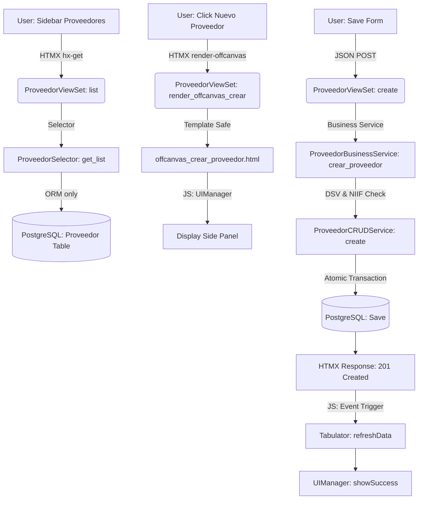

# [FLOW] SINTEL v3.5.0 — Proveedores Module Flow Map

Este mapa describe el flujo de datos y renderizado para la gestión de proveedores en SINTEL.

## Puntos Críticos del Flujo

### 1. Resolución de Configuración Tributaria
Al crear un gasto relacionado con un proveedor:
1. El sistema invoca `obtener_configuracion_retenciones`.
2. Se evalúa el flag `autoretenedor`.
3. Se aplica el porcentaje de ReteFuente (4% por defecto si no es autorretenedor) y ReteICA (0.966% para personas naturales).

### 2. Sincronización de Identificadores (NIT)
El sistema normaliza automáticamente los campos `nit` y `numero_documento` para asegurar que las búsquedas e integridad de datos sean consistentes entre diferentes módulos (Gastos vs Directorio).

### 3. Auto-Healing del DOM
Si el usuario navega directamente a una URL de creación sin pasar por el listado, el script `proveedores.form.js` detecta la ausencia del contenedor `#containerOffcanvasProveedor` y lo crea dinámicamente antes de inicializar el componente Bootstrap.
