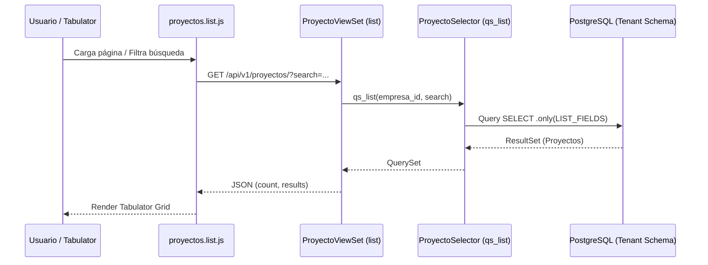
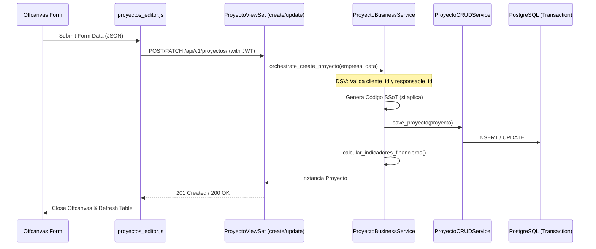
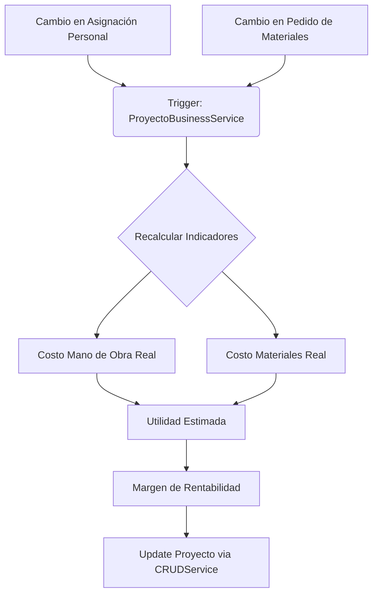

# Mapa de Flujo: Módulo Proyectos v3.5.0

Este documento describe cómo fluyen los datos y las acciones en el módulo de **Proyectos**, desde el frontend hasta la persistencia en la base de datos.

## 1. Flujo de Listado (Data Grid)

## 2. Flujo de Creación / Edición (Offcanvas + DSV)

## 3. Flujo de Gestión Financiera (Async/Internal)

## 4. Patrón de Desacoplamiento (Snapshots)

| Acción | Origen (Módulo) | Destino (Proyectos) | Mecanismo |
| :--- | :--- | :--- | :--- |
| Selección de Cliente | Clientes | `cliente_id`, `cliente_nombre` | API Fetch + Snapshot |
| Asignación de Responsable | Empleados | `responsable_id`, `responsable_nombre` | API Fetch + Snapshot |
| Gasto de Materiales | Inventario | `material_ref`, `precio_unitario` | Snapshot en Pedido |
