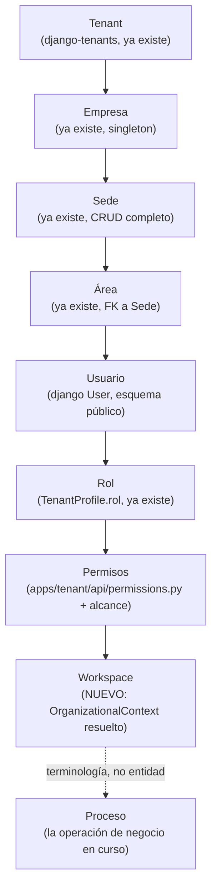
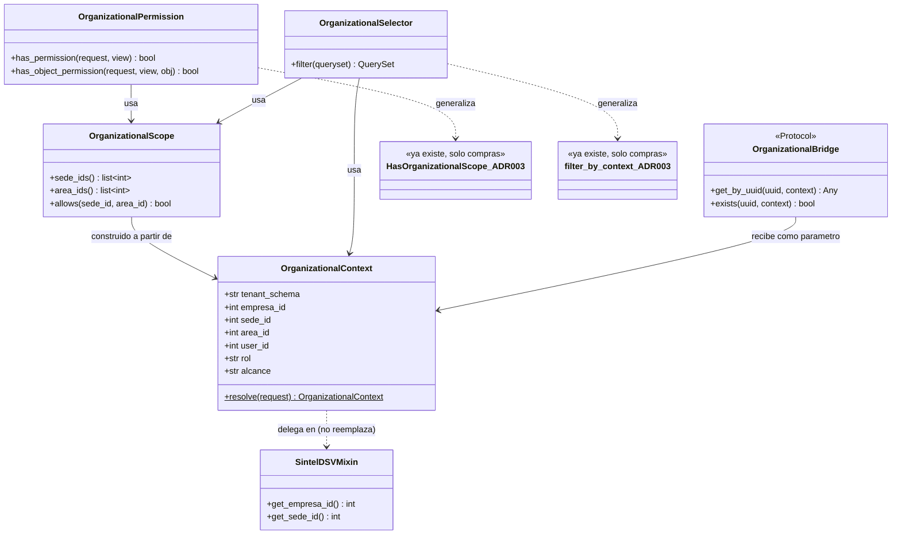
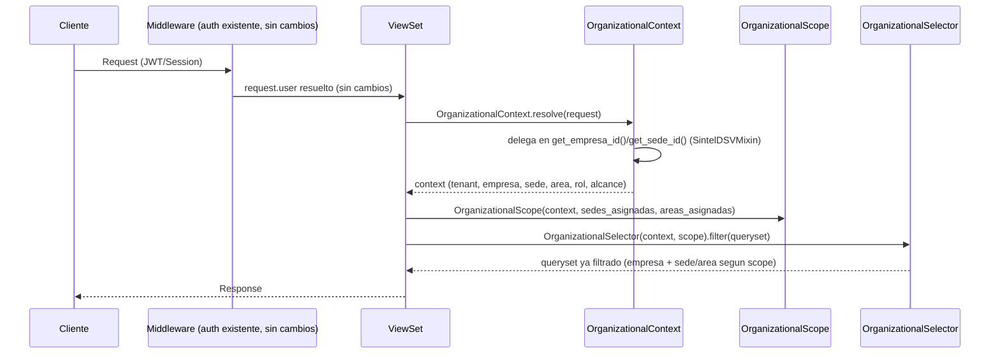

# ADR-004: Organizational Context Framework (OCF) — Modelo de Diseño (Fase 1)

**Estado:** ACCEPTED (parcialmente implementado — ver "Adenda 2026-08-09" al final del documento antes de asumir cobertura total)
**Fecha:** 2026-08-07 (diseño original) — estado actualizado 2026-08-09 tras auditoría de código real (FASE 1-4 de `documentacion/ORGANIZATIONAL_SCOPE_MIGRATION_STATUS.md`)
**Autores:** Sintel Engineering
**Relacionado con:** ADR-003 (piloto `compras`), ADR-005 (OSF — filtrado de alcance sin migración de esquema), `documentacion/IMPLEMENTACION_ORGANIZATIONAL_CONTEXT.md` (Fase 0 — auditoría de las 17 apps)

> **Nota de gobernanza (2026-08-09):** el cuerpo original de este documento (debajo, sin editar)
> describe exclusivamente la Fase 1 (diseño) del proyecto OCF, tal como se escribió el
> 2026-08-07 — "cero código, cero módulos modificados" era honesto y verificado en ese momento.
> Las Fases 2-13 de OCF se ejecutaron después (mismo día y el 2026-08-08, según `MEMORY.md`) y
> **nunca se volvió a este ADR para actualizarlo** — quedó describiendo solo el punto de partida,
> no el resultado. La auditoría de código real de 2026-08-09
> (`documentacion/OCF_TECHNICAL_AUDIT.md`) verificó qué de este diseño se construyó, qué se
> desvió, y qué nunca tuvo consumidor de producción. Ver "Adenda 2026-08-09" al final — léala
> antes de asumir que las "5 abstracciones nuevas" de este documento describen el estado actual
> del código sin más.

---

## Contexto

Fase 0 (auditoría, ver `documentacion/IMPLEMENTACION_ORGANIZATIONAL_CONTEXT.md`) confirmó que el
piloto ADR-003 (`compras`) es el único punto del proyecto donde `sede` se usa para algo más que
reporte, y que las 16 apps restantes resuelven `empresa_id` de forma dispersa (cada
`business_service.py`/`selectors.py` repite `.filter(empresa_id=...)` y comparaciones `!=` de
DSV por su cuenta). El pedido OCF pide generalizar esto a un **Contexto Organizacional único**,
consumido de forma homogénea por las 17 apps, más 5 capas nuevas (Permisos jerárquicos, DSV
organizacional, Selectors, Bridges, Service Layer) que ADR-003 solo prototipó para una app.

Esta fase es **exclusivamente de diseño**: ningún módulo existente se modifica. El resultado es el
contrato que las Fases 2-9 implementarán y migrarán, app por app, de forma controlada.

---

## Decisión: Jerarquía completa

```
Tenant (django-tenants, ya existe)
  └── Empresa (ya existe, singleton por schema)
        └── Sede (ya existe, CRUD completo)
              └── Área (ya existe, FK a Sede)
                    └── Usuario (django User, esquema público)
                          └── Rol (TenantProfile.rol — ya existe: ADMIN/OPERADOR/VISOR)
                                └── Permisos (apps/tenant/api/permissions.py + `alcance`, ADR-003)
                                      └── Workspace (formalizado por primera vez en este ADR —
                                                      ver "Workspace" abajo)
```

**"Proceso"** (nivel final del pedido original) se documenta aquí como **terminología, no como
entidad nueva** — decisión explícita del usuario (mismo criterio que ADR-003 aplicó a este mismo
nivel): "Proceso" es el nombre conceptual de *la operación de negocio que se ejecuta dentro de un
Workspace* (ej. "crear una Orden de Compra" es un Proceso). No se crea ningún modelo/tabla. Ningún
criterio de éxito del pedido OCF depende de que exista como entidad — solo de que la jerarquía
Empresa→Sede→Área se consuma sin duplicar lógica de filtrado, lo cual no requiere un nivel
"Proceso" formal.

**"Workspace"** tampoco es una entidad de base de datos nueva: es el nombre que este ADR le da al
**resultado resuelto** de `OrganizationalContext` — el conjunto `{tenant, empresa, sede, área,
usuario, rol, permisos}` disponible durante una request. Ya existe conceptualmente (el UI shell en
`apps/tenant/core/templates/tenant/core/workspace.html`); este ADR lo formaliza como un objeto de
backend, no solo una página.

---

## Decisión de diseño heredada de ADR-003 (no se reabre)

`OrganizationalContext` se resuelve **vía el mismo mecanismo de mixin que ya usa
`SintelDSVMixin.get_empresa_id()`/`get_sede_id()`** (`apps/tenant/api/mixins.py`) — **no** vía un
middleware que mute `request.*`. ADR-003 ya documentó por qué (evitar dos mecanismos de resolución
en paralelo); este proyecto generaliza ese mismo mecanismo, no lo reemplaza. `OrganizationalContext`
es, en términos concretos, un envoltorio tipado sobre lo que esos métodos ya resuelven — no una
segunda fuente de verdad.

---

## Las 5 abstracciones nuevas

### 1. `OrganizationalContext`

**Propósito:** un único objeto inmutable, resuelto una vez por request, que reemplaza el acceso
disperso a `request.user`, `get_empresa_id()`, `get_sede_id()`, `perfil.rol`, `perfil.alcance`.
Ningún ViewSet/Service debe volver a leer `request.user` directamente una vez migrado (Fase 2+) —
todo pasa por este objeto.

```python
# Contrato (Fase 2 lo implementa; aquí es diseño, no código a ejecutar)
@dataclass(frozen=True)
class OrganizationalContext:
    tenant_schema: str
    tenant_id: int
    empresa_id: int
    sede_id: int | None          # None = empresa aun sin ninguna Sede (caso borde ya manejado en ADR-003)
    area_id: int | None          # None = sin area activa (la mayoria de operaciones no la requieren)
    user_id: int
    perfil_id: int | None
    rol: str                     # RolTenant: ADMIN / OPERADOR / VISOR (SSoT sin cambios)
    alcance: str                 # AlcanceOrganizacional: EMPRESA / SEDE / AREA (SSoT sin cambios, ADR-003)
    timezone: str
    configuracion: dict          # snapshot de TenantProfile.configuracion (preferencias UI, etc.)

    @classmethod
    def resolve(cls, request) -> "OrganizationalContext":
        """Delega en SintelDSVMixin.get_empresa_id()/get_sede_id() y en
        perfil.rol/alcance ya existentes. No re-implementa resolucion — la
        empaqueta."""
```

**No rompe nada:** `get_empresa_id()`/`get_sede_id()` siguen existiendo y funcionando igual;
`OrganizationalContext.resolve()` los llama internamente. Las 17 apps pueden adoptar el objeto
gradualmente (Fase 9) sin que las que no lo hayan adoptado aún dejen de funcionar.

### 2. `OrganizationalScope`

**Propósito:** encapsular qué significa "alcance" (`EMPRESA`/`SEDE`/`AREA`) como comportamiento,
no como si/entonces repetido en cada permiso. Generaliza `HasOrganizationalScope` (ADR-003, hoy
solo en `compras`).

```python
class OrganizationalScope:
    def __init__(self, context: OrganizationalContext, sedes_asignadas: list[int], areas_asignadas: list[int]):
        ...

    def sede_ids(self) -> list[int] | None:
        """None = sin restriccion (alcance EMPRESA). Lista = sedes permitidas (alcance SEDE/AREA)."""

    def area_ids(self) -> list[int] | None: ...

    def allows(self, *, sede_id: int | None = None, area_id: int | None = None) -> bool:
        """Reemplaza la logica inline de HasOrganizationalScope.has_object_permission()."""
```

### 3. `OrganizationalPermission`

**Propósito:** la jerarquía completa pedida (ADMIN GLOBAL → ADMIN EMPRESA → ADMIN SEDE → JEFE
ÁREA → OPERADOR → VISOR), **sin reemplazar `RolTenant`** (mismo criterio ya acordado en ADR-003:
`alcance` es ortogonal a `rol`, no un enum de 6 valores nuevo).

| Nivel del pedido | Mapeo real (sin campo nuevo) |
|---|---|
| ADMIN GLOBAL | `is_staff`/`is_superuser` de Django (esquema público) — ya existe, fuera de `TenantProfile` |
| ADMIN EMPRESA | `rol=ADMIN` + `alcance=EMPRESA` (ya existe, ADR-003) |
| ADMIN SEDE | `rol=ADMIN` + `alcance=SEDE` (ya existe, ADR-003) |
| **JEFE ÁREA** | `rol=ADMIN` + `alcance=AREA` — **combinación ya representable hoy**, pero Fase 0 no encontró ningún caso de uso real que distinga "jefe de área" de "operador de área". Se diseña la interfaz; la regla de negocio específica de "jefe" (ej. puede aprobar, un operador de área no) se implementa solo cuando una app real lo necesite (Fase 4, no antes). |
| OPERADOR | `rol=OPERADOR` (con cualquier `alcance`) — ya existe |
| CONSULTA | `rol=VISOR` (con cualquier `alcance`) — ya existe |

```python
class OrganizationalPermission(permissions.BasePermission):
    """Generaliza HasOrganizationalScope (ADR-003) para cualquier ViewSet,
    en vez de estar acoplado a compras. Misma logica, parametrizada por
    OrganizationalContext en vez de resolver perfil/empresa inline."""
    def has_permission(self, request, view) -> bool: ...
    def has_object_permission(self, request, view, obj) -> bool: ...
```

### 4. `OrganizationalSelector`

**Propósito:** reemplazar `.filter(empresa_id=...)` repetido (confirmado en Fase 0: las 16 apps
no-piloto lo repiten cada una en su propio `selectors.py`) por `context.filter(Model)`. Generaliza
`filter_by_context()` (ADR-003, hoy en `apps/tenant/core/services/organizational_filters.py`,
consumido solo por `compras`).

```python
class OrganizationalSelector:
    def __init__(self, context: OrganizationalContext, scope: OrganizationalScope): ...

    def filter(self, queryset: QuerySet) -> QuerySet:
        """Aplica empresa_id siempre; sede_id/area_id solo si el modelo los
        tiene (SedeAwareModel) Y el scope los restringe. Sobre un modelo sin
        sede/area, se comporta identico al .filter(empresa_id=...) actual —
        no rompe ninguna app que no haya adoptado SedeAwareModel todavia."""
```

**Migración no-disruptiva:** cada app decide en su propia fase (Fase 9) si su `get_list()` pasa a
usar `OrganizationalSelector.filter()` en vez de `.filter(empresa_id=...)` directo — el contrato
es aditivo, no un reemplazo forzado del selector existente.

### 5. `OrganizationalBridge`

**Propósito:** formalizar el patrón que **ya existe y funciona** en `facturas`
(`CotizacionBridge`, `ClienteBridge`, `ProveedorBridge`, `InventarioItemBridge`, `BancosBridge` —
5 clases, ver Fase 0 Anexo A.9) como un contrato común, para que:
1. Todo bridge futuro tenga una firma consistente (hoy 3 de los 5 aceptan `empresa_id=None`
   opcional y 2 lo exigen primero — inconsistencia menor que este contrato resuelve para bridges
   *nuevos*, sin forzar romper los 5 existentes).
2. El Knowledge Graph (Fase 10) pueda representar "X usa OrganizationalBridge de Y" como una
   relación tipada, en vez de inferir un bridge por convención de nombre de clase.
3. **Resuelve conceptualmente el Riesgo R-2 de Fase 0** (`FacturaInterAppAPI` sin filtro
   `empresa_id`, "[ABIERTO]" por diseño): el contrato exige que todo `OrganizationalBridge` reciba
   `OrganizationalContext`/`OrganizationalScope`, y que una API deliberadamente abierta (como
   `FacturaInterAppAPI`) se declare explícitamente como tal (ya lo hace, con el comentario
   "[ABIERTO]" en el código) — el contrato no prohíbe la excepción, pero la hace *visible y
   auditable* por la Fase 11 (Gobernanza), en vez de ser un patrón implícito que solo se descubre
   leyendo el código fuente.

```python
class OrganizationalBridge(Protocol):
    """Contrato para lectura inter-app. Los 5 bridges de facturas son los
    primeros candidatos a adoptarlo (Fase 7) - ninguno se reescribe en esta
    fase de diseño."""
    def get_by_uuid(self, uuid: str, context: OrganizationalContext) -> Any | None: ...
    def exists(self, uuid: str, context: OrganizationalContext) -> bool: ...
```

---

## Diagrama de jerarquía



## Diagrama UML — las 5 abstracciones



## Diagrama de secuencia — resolución en una request



---

## Relación explícita con lo ya construido (ADR-003)

| Abstracción nueva (este ADR) | Antecesor ya implementado (ADR-003, solo `compras`) |
|---|---|
| `OrganizationalContext.resolve()` | `SintelDSVMixin.get_empresa_id()` / `get_sede_id()` (`apps/tenant/api/mixins.py`) |
| `OrganizationalScope` | `HasOrganizationalScope` (`apps/tenant/api/permissions.py`) |
| `OrganizationalPermission` | `HasOrganizationalScope` aplicada a `OrdenCompraViewSet` únicamente |
| `OrganizationalSelector` | `filter_by_context()` (`apps/tenant/core/services/organizational_filters.py`) |
| `OrganizationalBridge` | Los 5 `*Bridge` de `facturas` (candidatos a adoptar el contrato, no reescritos aún) |

Ninguna abstracción nueva reemplaza su antecesor en esta fase — Fase 2 decide si el antecesor se
envuelve (wrapper) o se migra in-place, app por app.

---

## Riesgos de diseño (específicos de Fase 1, no repiten Fase 0)

| ID | Riesgo | Severidad |
|---|---|---|
| D-1 | Migrar 17 apps a `OrganizationalSelector` sin romper la firma actual (`get_list(empresa_id, ...)`) exige que sea aditivo, no un reemplazo forzado — Fase 6 debe decidir opt-in gradual (mismo criterio que `SedeAwareModel`), no un `sed` masivo. |
| D-2 | Formalizar `OrganizationalBridge` podría tentar a "corregir" los 5 bridges de `facturas` para que todos exijan `empresa_id` obligatorio (hoy 3 lo tienen opcional) — **no está en el alcance de ninguna fase todavía**; Fase 7 debe tratarlos como "adoptar el contrato sobre la firma actual", no reescribir comportamiento ya probado en producción. |
| D-3 | `JEFE ÁREA` (`rol=ADMIN`+`alcance=AREA`) no tiene ningún caso de uso real verificado en Fase 0 — se diseña la interfaz, pero implementar una regla de negocio distintiva ("jefe puede aprobar, operador de área no") sin un caso real sería inventar requisitos. Fase 4 debe esperar un caso de uso concreto antes de escribir esa lógica. |
| D-4 | R-2 de Fase 0 (`FacturaInterAppAPI` sin filtro `empresa_id`) queda **documentado como excepción visible**, no resuelto — resolverlo (agregar filtro) es una decisión de producto (¿debe seguir siendo "abierta"?) que excede el alcance de diseño de esta fase. |

---

## Checklist de cierre de Fase 1

- [x] Jerarquía completa documentada (Tenant→Empresa→Sede→Área→Usuario→Rol→Permisos→Workspace)
- [x] Decisión sobre "Proceso" tomada explícitamente con el usuario (terminología, no entidad)
- [x] Las 5 abstracciones diseñadas con contrato/interfaz (`OrganizationalContext`, `OrganizationalScope`, `OrganizationalPermission`, `OrganizationalSelector`, `OrganizationalBridge`)
- [x] Diagramas: jerarquía, UML de clases, secuencia de resolución
- [x] Relación explícita con ADR-003 (qué generaliza qué, sin reemplazar nada todavía)
- [x] Riesgos de diseño identificados (4)
- [x] Cero código escrito, cero módulos modificados — confirmado

---

## Adenda 2026-08-09 — Qué se construyó realmente (Fases 2-13) vs. lo diseñado aquí

Auditoría completa en `documentacion/OCF_TECHNICAL_AUDIT.md` (FASE 1 del plan de consolidación,
`documentacion/ORGANIZATIONAL_SCOPE_MIGRATION_STATUS.md`). Resumen por abstracción, contra el
diseño original de este ADR:

| Abstracción (diseño de este ADR) | ¿Se construyó? | ¿Coincide con el diseño? | ¿Tiene consumidor de producción hoy? |
|---|---|---|---|
| `OrganizationalContext` | Sí (`organizational_context.py`) | Sí, casi exacto (dataclass frozen, mismos campos) | Parcial — resuelto por `ContextoOrganizacionalView`; el `Mixin` está heredado en 14 ViewSets pero **nunca invocado** |
| `OrganizationalScope` | Sí (`organizational_scope.py`) | **No** — diverge del diseño (ver abajo) | Sí — 8 apps, ~20 sitios |
| `OrganizationalPermission` | Sí (`organizational_permissions.py` + clase en `permissions.py`) | Sí | **No** — ningún ViewSet declara `minimum_organizational_level` |
| `OrganizationalSelector` | **No** — nunca se construyó como clase | N/A | N/A — su función la cumplen `filter_by_context`/`filter_by_scope`/`filter_by_scope_null_safe` (funciones puras) y `OrganizationalContext.filter()`/`OrganizationalScope.filter()` (métodos), no una clase `OrganizationalSelector(context, scope)` |
| `OrganizationalBridge` | Sí (`organizational_bridges.py`, 3 de 5 bridges adaptados) | Sí, incluida la decisión honesta de no forzar los 2 que no encajan | **No** — cero consumidores de producción |

**Dos divergencias reales de diseño, no solo de estado:**

1. **`OrganizationalScope` NO se construye a partir de `OrganizationalContext`.** El diagrama UML
   de este ADR (`OrganizationalScope --> OrganizationalContext : construido a partir de`) y su
   `__init__(self, context: OrganizationalContext, sedes_asignadas, areas_asignadas)` proponían
   que `OrganizationalScope` fuera un envoltorio sobre un `OrganizationalContext` ya resuelto. La
   implementación real (`OrganizationalScope.resolve(request)`) resuelve **de forma
   independiente**, sin recibir ni depender de un `OrganizationalContext` — decisión explícita
   documentada en el propio módulo (`organizational_scope.py:131-141`): "decisión explícita del
   usuario de mantener ambos conceptos sin acoplarlos entre sí". Es un pivote de diseño real,
   tomado durante la implementación (probablemente en la Fase F2 de OSF, ver ADR-005), nunca
   traído de vuelta a corregir este ADR.
2. **`OrganizationalSelector` como clase nunca se construyó.** En su lugar, cada Selector llama
   directamente `filter_by_scope()`/`filter_by_scope_null_safe()` (funciones puras) o
   `context.filter(Model)`/`scope.filter(Model)` (métodos de las propias dataclasses). El
   resultado funcional es equivalente al propósito que este ADR le daba a `OrganizationalSelector`
   ("reemplazar `.filter(empresa_id=...)` repetido"), pero la forma concreta (funciones + métodos,
   no una clase separada con `__init__(context, scope)`) es distinta a la diseñada aquí.

**No se corrige el diagrama UML/las firmas de código de este documento** — se preserva como
registro histórico de lo que se diseñó el 2026-08-07. Esta adenda documenta el resultado real sin
reescribir la decisión original. Ver `documentacion/ORGANIZATIONAL_CONTRACT.md` (FASE 3) para el
contrato definitivo y correcto de `OrganizationalContext`/`OrganizationalScope` tal como existen
hoy, y ADR-005 para la decisión arquitectónica real que llevó a la divergencia #1.

**Por qué el Estado pasa a ACCEPTED (parcial) y no a IMPLEMENTED:** de las 5 abstracciones, 3
tienen código real (`OrganizationalContext`, `OrganizationalScope`, `OrganizationalPermission`,
`OrganizationalBridge` — 4, en realidad) pero solo 1 (`OrganizationalScope`, vía las funciones de
filtrado) tiene consumidores de producción reales fuera de sus propios tests. "IMPLEMENTED" sin
matiz sobrestimaría la adopción real — ver tabla de consumidores en
`documentacion/OCF_TECHNICAL_AUDIT.md` §0.
