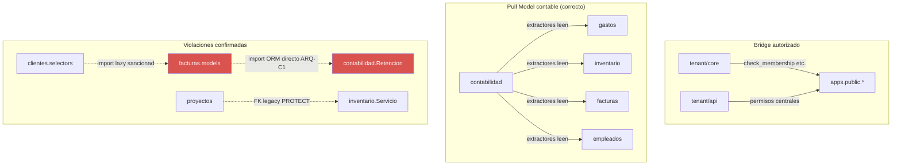

# AUDITORÍA INTEGRAL ENTERPRISE — SINTEL ERP (crm_sintel)

**Fecha de auditoría:** 2026-07-26
**Alcance:** Repositorio completo (`C:\Users\Administrator\Documents\crm_sintel`), HEAD en commit `5bab0b9` (rama `feat/onboarding-cookie`)
**Metodología:** Auditoría estática de solo lectura (no se modificó ningún archivo, no se ejecutaron migraciones/tests/docker). Seis frentes de auditoría independientes ejecutados en paralelo, cada uno con lectura completa de `AGENTS.md`, `documentacion/arquitectura_general.md`, `MEMORY.md`, `CLAUDE.md`, los ADRs en `docs/`, y los `.agent/AUDITORIA_FLUJO_*.md` por app, seguido de barridos sistemáticos con grep/glob sobre el 100% del árbol `apps/` y lecturas profundas de los archivos críticos por capa (modelos, servicios, viewsets, selectores, JS, templates).
**Fuentes canónicas utilizadas:** `documentacion/arquitectura_general.md` (v3.10.5, 2026-06-15), `AGENTS.md` (2128 líneas), `MEMORY.md`, `docs/ADR-001/002`, `.agent/AUDITORIA_FLUJO_*.md` por app.
**Nota de honestidad metodológica:** con ~106.000 líneas de Python (excl. migraciones/tests), 206 archivos JS y 268 plantillas HTML repartidos en 20 apps tenant + 6 apps públicas, una lectura línea-por-línea del 100% del código no es alcanzable en una sola pasada. Se aplicó **cobertura exhaustiva por patrón** (grep del 100% del árbol para cada anti-patrón buscado: imports cruzados, `cuenta_*_uuid`, `parseInt` sobre UUID, `|safe`, `csrf_exempt`, etc.) combinada con **lectura profunda representativa** (modelos, servicios y viewsets completos de las apps más grandes/críticas: contabilidad, facturas, core, empleados, empresa, proyectos, inventario, gastos, y muestreo del resto). Los hallazgos de "código muerto" en particular son una muestra representativa, no exhaustiva, y se señala explícitamente dónde.

---

## 1. Resumen Ejecutivo

SINTEL ERP es un sistema SaaS multi-tenant de facturación electrónica y contabilidad NIIF para Colombia, construido sobre Django 5 + django-tenants (aislamiento por esquema PostgreSQL) con Feature-Sliced Design (FSD) y Service Layer estricto. La arquitectura documentada es sólida y, en gran medida, **sí se cumple en el código real**: el patrón `SintelTenantBaseModel` → Selector → BusinessService (DSV) → CRUDService se respeta de forma consistente en las 17 apps de negocio activas, no se encontraron regresiones del ADR-002 (desacoplamiento contable), y el aislamiento de esquema PostgreSQL sigue siendo la defensa estructural más fuerte del sistema.

Sin embargo, la auditoría encontró **15 hallazgos CRÍTICOS** que exigen atención antes de cualquier despliegue a producción, concentrados en tres áreas:

1. **Seguridad de configuración**: `DJANGO_DEBUG` tiene valor por defecto `True` en `config/settings.py`, y ese único flag desactiva en cascada las verificaciones de membresía de tenant, CSRF y roles en `apps/tenant/api/permissions.py` y `apps/public/core/middleware.py`. Si alguna vez este flag no se fija explícitamente a `False` en el entorno real, **todo el modelo Zero-Trust documentado deja de aplicarse**.
2. **Integridad financiera**: existen dos condiciones de carrera sin bloqueo (`select_for_update`) ni restricción `UNIQUE` en base de datos capaces de duplicar asientos contables (`AsientoContable`) y números de factura (`Factura.consecutivo`) — exactamente los dos artefactos que un ERP contable no puede permitirse duplicar.
3. **Bug de datos en producción (frontend)**: un `parseInt()` aplicado a un UUID en el editor de inventario corrompe el identificador del producto en cada guardado — confirmado contra el serializer real, no es una hipótesis.

Además, la auditoría reveló una **brecha de gobernanza documental**: los dos documentos que `AGENTS.md` exige leer primero (`documentacion/arquitectura_general.md` y `MEMORY.md`) están desactualizados respecto al HEAD real — faltan dos apps de negocio completas (`compras`, `ventas`) del inventario, y `MEMORY.md` no registra ninguna actividad desde 2026-05-06 pese a haber al menos 5 releases funcionales posteriores. También se confirmó que el pipeline de CI (`verify-core.yml`, `verify-phase5.yml`) **nunca ejecuta** la suite de 329 archivos de test, `ruff`, `bandit`, ni un escaneo de dependencias — todos los controles de calidad son manuales.

**Nivel de calidad general:** MEDIO (61/100) — arquitectura de base sólida, pero con riesgo de cola pesado (seguridad, pruebas no automatizadas, documentación).
**Riesgo global:** **ALTO** — no por volumen de deuda técnica, sino porque los hallazgos críticos tocan control de acceso, integridad contable y datos de inventario.
**Cumplimiento arquitectónico (regla-por-regla, verificado por grep):** **~88%** — la mayoría de las reglas no-negociables de `AGENTS.md` se cumplen literalmente; el 12% restante se concentra en un puñado de violaciones puntuales pero de alto impacto (import cruzado a `contabilidad.Retencion`, `lookup_field='id'` en 4 ViewSets, `on_delete=CASCADE` en 4 modelos donde la base exige `PROTECT`).

---

## 2. Score General (0–100)

| Dimensión | Score | Justificación breve |
|---|---:|---|
| Arquitectura | **80** | FSD y Service Layer consistentes en 17/17 apps; Pull Model contable intacto (0 regresiones ADR-002); penalizado por import directo a `contabilidad.Retencion` desde `facturas.models` y estructura incompleta en `inventario` |
| Calidad de código | **70** | Buena separación de responsabilidades; penalizado por triplicación de `StandardResultsSetPagination` con valores distintos, 16 reimplementaciones divergentes de `mostrarOffcanvasSeguro`, y funciones/apps huérfanas |
| Seguridad | **55** | `DEBUG=True` por defecto con cascada de bypass de permisos/CSRF, 1 IDOR confirmado (Factura items/notas crédito), 2 XSS almacenados, 1 XXE potencial |
| Performance | **62** | Buenos patrones ya presentes (bulk_create en bancos, select_for_update en gastos/inventario/ventas/cotizaciones); penalizado por N+1 severo en el listado de Facturas (hasta ~140 queries extra por página) y falta de `bulk_create` en el extractor contable |
| Mantenibilidad | **66** | Estructura FSD predecible facilita el mantenimiento; penalizado por deriva documental severa y por 3 apps (`compras`, `ventas`, `bancos`) sin ningún test |
| Escalabilidad | **74** | Esquema-por-tenant + Celery + Pull Model son decisiones correctas para escalar horizontalmente; el extractor de contabilidad sin `bulk_create` es el principal cuello de botella conocido |
| Simplicidad | **68** | Patrón repetible por app (FSD) es simple de razonar; penalizado por duplicación de helpers JS que debieron centralizarse desde el inicio |
| Cobertura de pruebas | **38** | 329 archivos de test existen, pero el test obligatorio `test_multitenant_isolation.py` (AGENTS.md §24.5) solo existe en 2 de ~16 apps calificadas, `ventas` tiene 0 tests, y ninguno de estos tests corre en CI |
| Documentación | **42** | `MEMORY.md` congelado desde 2026-05-06; `arquitectura_general.md` omite 2 apps de negocio completas; referencias a archivos inexistentes (`REFACTORIZAR_DESACOPLAMIENTO_CONTABLE_FRAMEWORK.md`) |
| Deuda técnica (control) | **50** | ~90 elementos de código muerto/duplicación identificados (apps huérfanas completas `mail`/`mailinbox`/`templates`, migraciones con alta rotación en `proveedores`/`gastos`); ninguno es bloqueante por sí solo, pero el volumen es alto |
| **PROMEDIO GENERAL** | **61 / 100** | **Calidad MEDIA — Riesgo ALTO por concentración de hallazgos críticos** |

---

## 3. Hallazgos Consolidados por Prioridad

Esquema de identificadores: `ARQ`=Arquitectura/FSD, `SEC`=Seguridad, `PERF`=Base de datos/Performance, `FE`=Frontend, `DEAD`=Código muerto/duplicidad, `TEST`/`DEVOPS`/`DEP`/`DOC`=Track F (pruebas/DevOps/dependencias/documentación).

### 3.1 CRÍTICOS (15)

| ID | Hallazgo | Ubicación | Impacto |
|---|---|---|---|
| **SEC-C1** | `DEBUG` por defecto `True` (`config/settings.py:28`) desactiva en cascada `IsTenantMember`, `HasTenantRole`, `IsTenantProfileAdmin`, `IsTenantProfileOperadorOrAdmin`, `IsTenantAdminOrReadOnly` (todos en `apps/tenant/api/permissions.py`, todos retornan `True` si `DEBUG`), `SintelDSVMixin.get_empresa_id()` (`mixins.py:32-41`) y `DebugNoCSRFMiddleware` (`apps/public/core/middleware.py:354-371`) | `config/settings.py:28` | Si el entorno real no fija `DJANGO_DEBUG=False` explícitamente, **cualquier usuario autenticado de cualquier tenant puede leer/escribir datos de cualquier otro tenant**, con CSRF desactivado y roles ADMIN evitables. Máximo radio de explosión posible en el sistema. |
| **SEC-C2** | IDOR confirmado: `ItemFacturaViewSet` (`apps/tenant/facturas/api/viewsets.py:1016`) y `NotaCreditoViewSet` (`:1072`) solo tienen `permission_classes=[IsAuthenticated]`, sin `IsTenantMember` | `apps/tenant/facturas/api/viewsets.py:1016,1072` | Un usuario legítimo del Tenant A puede usar su JWT/sesión válida contra `tenant-b.sintel.net.co/api/v1/facturas/items-factura/` y `/notas-credito/` y operar sobre datos del Tenant B, porque la resolución de empresa cae a "la primera Empresa del esquema actual" sin verificar membresía. |
| **PERF-C1** | `AsientoContable` no tiene `UniqueConstraint` sobre `documento_origen` pese a que `arquitectura_general.md:475` afirma que sí — solo hay un índice no-único. `Contabilizador.contabilizar()` valida con `.exists()` sin `select_for_update()` | `apps/tenant/contabilidad/integracion/contabilizador.py:80-108`, `models.py:389-398` | Dos workers Celery procesando el mismo documento pendiente en paralelo pueden generar **dos asientos contables duplicados** para la misma transacción — corrupción del libro mayor. |
| **PERF-C2** | `Factura.consecutivo` se calcula con `Max()` sin `select_for_update()` ni `UniqueConstraint` en `(empresa, naturaleza, consecutivo)` | `apps/tenant/facturas/services/business_service.py:59-93` | Dos ventas convertidas a factura simultáneamente pueden producir **dos facturas con el mismo consecutivo** para la misma empresa — el resto del código (gastos, inventario, ventas, cotizaciones) sí bloquea correctamente esta misma operación; facturas es la excepción. |
| **PERF-C3** | Bug confirmado de tipo: `importar_factura_desde_ubl()` retorna una instancia `Factura` (`ubl_parser.py:1021`) pero `services_mail_ingestion.py:301-306` la trata como `dict` (`factura_data.get("numero")`) — `AttributeError` garantizado en cada uso de esta ruta de respaldo, **después** de que Factura+Items ya fueron persistidos sin transacción envolvente | `apps/tenant/facturas/utils/ubl_parser.py:999-1019`, `apps/tenant/facturas/services/services_mail_ingestion.py:301-306,710-711` | Facturas huérfanas (sin todos sus items, o con excepción no controlada) cada vez que se activa la ruta de respaldo del pipeline de ingesta de correo DIAN. |
| **FE-C1** | `parseInt()` aplicado a un UUID de producto — confirmado contra el serializer real (`ProductoListSerializer.id` es `UUIDField(source='uuid')`) | `apps/tenant/inventario/static/inventario/js/features/inventario_editor.js:50` | Cada ajuste de inventario envía un entero corrupto (`parseInt("9abc...")=9`) en lugar del UUID del producto → `DoesNotExist` en backend. Bug de datos en producción, no teórico. |
| **FE-C2** | Input oculto y `&lt;select&gt;` con el mismo `name="producto"` en el mismo formulario | `apps/tenant/inventario/templates/inventario/offcanvas_producto.html:23,27` | `FormData` solo captura uno de los dos; la selección del usuario en el dropdown puede descartarse silenciosamente. Agrava FE-C1. |
| **FE-C3** | Dos implementaciones de `window.http` compiten por ser la SSoT: `core/static/js/http.js` (correcta, inyecta JWT) se carga primero en `base.html:129`, pero `core/static/core/js/lib/http.js` (obsoleta, sin JWT) se carga después vía `assets_core.html:9` dentro de `workspace.html`, y **gana por orden de carga** | `apps/tenant/core/templates/tenant/core/workspace.html:287`, `apps/tenant/core/static/core/js/lib/http.js` | El shell SPA completo (dashboard, facturas, contabilidad, inventario, clientes, ventas, proveedores, compras, empleados, cotizaciones, gastos, bancos) opera silenciosamente sin cabecera `Authorization: Bearer`, anulando la mitad del contrato Dual-Auth documentado. |
| **TEST-C1** | `ventas` (OrdenVenta, v3.10.5) tiene **cero** archivos de test en todo el repositorio | — | Un módulo financiero completo (órdenes de venta) se fusionó sin ninguna verificación automatizada. |
| **TEST-C2** | La regla obligatoria de `AGENTS.md §24.5` (`test_multitenant_isolation.py` de 3 niveles por app) solo se cumple en 2 de ~16 apps calificadas (`gastos`, `bancos`) | Todo `apps/tenant/*/tests/` | El estándar anti-IDOR más explícito que el propio proyecto se impuso a sí mismo no se cumple en el 87% de las apps con modelos propios. |
| **DEVOPS-C1** | `.github/workflows/verify-core.yml` y `verify-phase5.yml` **no ejecutan** `pytest`, `ruff`, `bandit` ni `manage.py check` — solo corren scripts Node.js personalizados | `.github/workflows/*.yml` | Ninguno de los 329 archivos de test, ni las herramientas de calidad definidas en el `Makefile` (`make audit`), corren automáticamente en cada PR. Todos los controles de calidad dependen de que un humano recuerde ejecutarlos manualmente. |
| **DOC-C1** | `arquitectura_general.md` §2 omite por completo las apps `compras` y `ventas`, ambas con modelos, migraciones, servicios y API activos en `TENANT_APPS` | `documentacion/arquitectura_general.md` §2 vs `config/settings.py:100-118` | Cualquier agente (humano o IA) que siga la instrucción de `AGENTS.md §16` de "leer primero la arquitectura" no sabrá que estas dos apps existen. |
| **DOC-C2** | `MEMORY.md` no registra actividad desde 2026-05-06 y declara `"Tarea en Curso: Ninguna"`, pese a que el historial de git muestra al menos 5 releases funcionales posteriores (bancos, compras, ventas, Motor de Plantillas Contables v3.16.3) | `MEMORY.md` (raíz) | El archivo que `AGENTS.md §8.5` designa como "fuente canónica del estado actual" desinforma activamente a cualquiera que confíe en él. |
| **ARQ-C1** | `facturas/models.py` importa y consulta directamente `contabilidad.models.Retencion` en 6 sitios, en vez de usar `RetencionesService` (la API de servicio documentada para exactamente este caso) | `apps/tenant/facturas/models.py:237,255,273,442,460,478` | Acopla `models.py` de una app fuente directamente al esquema ORM de `contabilidad`; un cambio de schema en `Retencion` rompe `facturas` silenciosamente, sin pasar por la capa de servicio que existe para evitar justo esto. |
| **ARQ-C2** | `inventario` no tiene `services/api_mixins.py` — los `*ServiceMixin` de sus 6 modelos están mezclados dentro de `business_service.py`, violando la separación de capas FSD que las otras 16 apps sí respetan | `apps/tenant/inventario/services/__init__.py:25-33` | Única app de las 17 que no sigue la plantilla FSD completa; dificulta auditar el acoplamiento ViewSet↔Servicio específicamente en el dominio con **cero cobertura de tests**. |

### 3.2 ALTOS (36)

| ID | Hallazgo | Ubicación |
|---|---|---|
| SEC-A1 | XSS almacenado vía `\|safe` en campos de perfil editables por el usuario (`cargo`, `departamento`, `telefono_corporativo`) | `apps/tenant/perfil/templates/tenant/perfil/offcanvas_detalle_perfil.html:33,36,39` |
| SEC-A2 | XSS almacenado: lista Python embebida sin `json_script` dentro de un `&lt;script&gt;`, con datos configurables por el tenant (nombre de cuenta/regla contable) | `apps/tenant/contabilidad/templates/tenant/contabilidad/partials/pendiente_offcanvas_contabilizar.html:304` |
| SEC-A3 | `etree.XMLParser(..., huge_tree=True)` sin `resolve_entities=False` en el parser UBL de facturas — riesgo de XXE/bomba de entidades sobre XML no confiable | `apps/tenant/facturas/utils/ubl_parser.py:111-116,445-450` (y 2 parsers más en `impuestos`/`maildigester`) |
| SEC-A4 | `DepartamentoViewSet` permite lectura (`GET`) a cualquier usuario autenticado de cualquier tenant — `IsTenantAdminOrReadOnly` no valida membresía en `SAFE_METHODS` | `apps/tenant/perfil/api/viewsets.py:397` |
| PERF-A1 | Ver PERF-C3 (mismo hallazgo, componente de transacción no atómica) | `apps/tenant/facturas/utils/ubl_parser.py:999-1019` |
| PERF-A2 | Extractor contable procesa documentos pendientes uno por uno sin `bulk_create` para `MovimientoContable`/`ImpuestoDocumento` — 2500-4000 INSERTs individuales posibles en un backlog de 500 documentos | `apps/tenant/contabilidad/integracion/extractores/base.py:136-166`, `crud_service.py:26-81` |
| PERF-A3 | 9 ViewSets de catálogo DIAN (`impuestos`, público, `AllowAny`) sin `.only()`/`.defer()` — fetch de fila completa en endpoint no autenticado de alto tráfico | `apps/public/impuestos/api/viewsets.py:44-163` |
| FE-A1 | Guard `data-editor-initialized` ausente en 34 de 36 archivos `*_editor.js` (94%) | Ver lista completa en informe de Track D — todas las apps excepto `facturas` y `inventario/categorias` |
| FE-A2 | Race de doble-inicialización confirmada en producción: `MutationObserver` + `DOMContentLoaded` + `htmx:afterSettle` registran el mismo listener de submit sin guard | `apps/tenant/empresa/static/empresa/js/features/empresa_editor.js:186-227`, `apps/tenant/proyectos/static/proyectos/js/features/proyectos_editor.js:1030-1343` |
| FE-A3 | Patrón anti-backdrop de Offcanvas evitado directamente en templates (`getOrCreateInstance().show()` crudo dentro de `hx-on::after-request`) | `apps/tenant/perfil/templates/.../partials/list.html:17`, `apps/tenant/inventario/templates/inventario/list_categorias.html:15` |
| FE-A4 | Patrón anti-backdrop evitado en JS sin `.dispose()` previo — reutiliza estado interno de Bootstrap corrupto | `empleados/contrato_editor.js:59-67`, `empleados/empleado_editor.js:44-52`, `empleados/liquidacion_list.js:158-172`, `empleados/nomina_historial.js:56-59`, `proveedores/proveedores_form.js:74` |
| FE-A5 | `mostrarOffcanvasSeguro` reimplementado de forma independiente 16 veces (no importado desde un helper común); 2 de las 16 copias están rotas (ver FE-A4) | 16 archivos en `ventas`, `empleados`, `inventario`, `empresa` — ver Track D |
| FE-A6 | `setData()` usado en vez del `replaceData()` obligatorio, incluyendo dentro de un manejador de click sin `setTimeout` de diferimiento | `dashboard/dashboard_main.js:290,346`, `empleados/empleado_list.js:403`, `empleados/contrato_list.js:255`, `proveedores/cuentas_pagar_list.js:165`, `cotizaciones/servicio_editor.js:42`, `producto_editor.js:42` |
| FE-A7 | Assets de `facturas` violan la ruta obligatoria `static/&lt;app&gt;/js/` (usan `static/js/facturas/...`) | `apps/tenant/facturas/static/js/facturas/...` |
| FE-A8 | Los 12 templates de `inventario` completos carecen del prefijo obligatorio `tenant/` | `apps/tenant/inventario/templates/inventario/*.html` |
| FE-A9 | Lógica `getHeaders()`/CSRF duplicada de forma divergente en 3 apps; `ventas.api.js` depende de un input oculto de formulario tradicional que no está garantizado en páginas API-first → 403 silencioso si falta | `compras/compras.api.js:143-155`, `ventas/ventas.api.js:14-25`, `gastos/gastos.api.js:136-148` |
| ARQ-A1 | `lookup_field='id'` (PK entera expuesta) en 3 ViewSets cuyos modelos no tienen campo `uuid` | `contabilidad/api/viewsets.py:1133-1134`, `proyectos/api/viewsets.py:397-398,477-478` |
| ARQ-A2 | `on_delete` de `empresa` sobrescrito de `PROTECT` (base) a `CASCADE` en 4 modelos, permitiendo borrado en cascada de `TenantProfile`, `Sede`, `Area` y snapshots de dashboard al borrar una `Empresa` | `dashboard/models.py:17-19`, `empresa/models.py:464-466,504-506`, `perfil/models.py:86-88` |
| ARQ-A3 | Brecha ADR-002: 3 páginas estáticas de autenticación (`login`, `reset-request`, `reset-confirm`) llaman rutas API sin el patrón `IS_PUBLIC_DOMAIN`, y esas 3 acciones no están registradas en `public_api_urls.py` | `apps/tenant/core/static/tenant/core/auth/{login,reset-request,reset-confirm}.html` |
| ARQ-A4 | `apps/tenant/mail/` y `apps/tenant/mailinbox/` son apps huérfanas (sin `models.py`/`services/`/`api/`, no están en `TENANT_APPS`) — una de ellas contiene además un `modals.html` monolítico explícitamente prohibido | `apps/tenant/mail/`, `apps/tenant/mailinbox/` |
| DEAD-A1 | `StandardResultsSetPagination` reimplementada 3 veces con **valores distintos** (`page_size=10/100` vs. la SSoT `page_size=20/200`) — comportamiento de paginación inconsistente entre apps, no solo duplicación cosmética | `proyectos/api/viewsets.py:64`, `inventario/api/viewsets.py:40`, `clientes/api/viewsets.py:42` |
| TEST-A1 | `ventas`/`compras` (documentos financieros con lógica DSV) tienen 0 y 1 archivo de test respectivamente | `apps/tenant/{ventas,compras}/tests/` |
| TEST-A2 | Assertion tautológica: `try/except Exception: pass` seguido de `assert True` en test de "garantía atómica" | `tests/public/tenants/test_integrity.py:328` |
| TEST-A3 | `test_output.txt` (181 KB, volcado crudo de pytest) está **rastreado en git**, y su contenido documenta 3 tests fallando en el momento del commit | Confirmado vía `git log -- test_output.txt` |
| DEVOPS-A1 | `Dockerfile` no define `USER` — el contenedor corre como root | `Dockerfile:1-47` |
| DEVOPS-A2 | No existe `.dockerignore` — `COPY . /app` incluye `.env` (con `JWT_SECRET_KEY`, `EMAIL_HOST_PASSWORD`, `TUNNEL_TOKEN`), `.git/`, `venv/` en cada capa de imagen | Raíz del repo |
| DEVOPS-A3 | Ningún compose fija `DJANGO_DEBUG=False` explícitamente para producción — depende enteramente de que `.env` esté bien configurado (ver SEC-C1) | `docker-compose.yaml`, `docker-compose.prod.yaml` |
| DEVOPS-A4 | Sin escaneo de dependencias vulnerables (`pip-audit`/`safety`) en Makefile ni CI | — |
| DEVOPS-A5 | `make down` ejecuta `docker compose down -v`, borrando el volumen de PostgreSQL — un desarrollador que solo quiere "detener servicios" borra la base de datos local sin advertencia | `Makefile:6-7` |
| DEP-A1 | `django-rest-framework-mcp>=0.1.0a4` — paquete alfa fijado sin límite superior en producción | `requirements.txt:16` |
| DEP-A2 | Sin archivo de lock (`pip-compile`/Poetry/uv) — builds no reproducibles con rangos `>=`/`<` sueltos | `requirements.txt` |
| DOC-A1 | Versión/fecha del header de `arquitectura_general.md` (v3.10.5, 2026-06-15) está al menos 2 releases mayores por detrás del HEAD real (v3.16.3, Motor de Plantillas Contables) | `documentacion/arquitectura_general.md:3-4` |
| DOC-A2 | Tabla de cobertura de tests §10.3 desactualizada — afirma "inventario: 0 tests" cuando en realidad hay 4 en `tests/tenant/inventario/` | `documentacion/arquitectura_general.md` §10.3 |
| DOC-A3 | Índice §10.2 de documentos de auditoría por app omite `bancos`, `compras`, `cotizaciones`, `dashboard`, `landing`, `ventas` — todas con `.agent/` propio ya poblado | `documentacion/arquitectura_general.md` §10.2 |
| DOC-A4 | Referencia cruzada a `REFACTORIZAR_DESACOPLAMIENTO_CONTABLE_FRAMEWORK.md` (citado en 2 documentos canónicos) — el archivo **no existe** en el repositorio | `AGENTS.md`, `arquitectura_general.md` §7 |
| DOC-A5 | La auditoría previa propia del proyecto (`INFORME_AUDITORIA_TENANT_APPS.md`, 2026-06-01, "99% PRODUCTION READY") tiene sus 3 hallazgos originales aún sin resolver 6+ semanas después; uno de ellos (`servicio_asociado` en `proyectos`) tiene ahora 15+ referencias activas, contradiciendo el propio criterio de remoción del informe original | `documentacion/INFORME_AUDITORIA_TENANT_APPS.md` |

### 3.3 MEDIOS (42)

Se listan agrupados por tipo; el detalle línea-por-línea completo está en los informes de cada track (referenciados por ID).

| ID | Hallazgo (resumen) |
|---|---|
| SEC-M1 | SSRF potencial en ingesta de documentos DIAN por staff — `requests.get(url_origen)` sin allowlist de host |
| SEC-M2 | 2 XSS adicionales vía `\|safe` en páginas de consola staff-to-staff (resultados de búsqueda, logs) |
| SEC-M3 | Clave Fernet de cifrado de credenciales IMAP se genera en memoria (no persistente) si falta `MAILCFG_FERNET_KEY` y `DEBUG=True` |
| SEC-M4 | Métodos `[ABIERTO]` documentados explícitamente sin validar `empresa_id` en `facturas`/`contabilidad` business_service — mitigado hoy por aislamiento de esquema, pero es deuda de defensa en profundidad |
| SEC-M5 | `CORS_ALLOW_CREDENTIALS=True` + regex wildcard `*.sintel.net.co` + cookie CSRF compartida entre subdominios y legible por JS |
| SEC-M6 | Logging de payload completo de request (`request.data`) en 4 ViewSets, incluyendo datos salariales/PII en `empleados` |
| SEC-M7 | 4 ViewSets no heredan `BaseTenantViewSet` y exponen PK entera en URL (info-disclosure de bajo impacto, no IDOR real) |
| PERF-M1 | Escritura de ítem de presupuesto y recálculo del proyecto padre en dos transacciones separadas — drift de totales cacheados si falla el segundo paso |
| PERF-M2 | Query de historial completo de inventario sin filtro de fecha, re-ejecutada en cada verificación de pendientes contables — crece linealmente con la antigüedad del tenant |
| PERF-M3 | Código muerto con patrón N+1 (`get_balance_prueba`/`calcular_saldos_cuenta`) — no se usa en producción pero sigue exportado como superficie pública del servicio |
| PERF-M4 | Alta rotación de migraciones en `proveedores` (crear→borrar→recrear→renombrar un mismo modelo en 8 migraciones) — candidato a `squashmigrations` |
| PERF-M5 | `make migrate-tenants`/`migrate-shared` usan `--fake-initial` de forma incondicional — enmascara drift de esquema real en vez de solo usarse en el bootstrap inicial |
| PERF-M6 | `DocumentoSelector.get_detail()` en `gastos` es la única función del archivo sin `.only()`, pese a tener una constante `DOCUMENTO_DETAIL_FIELDS` ya definida y sin usar |
| PERF-M7 | `contabilidad/crud_service.py` crea `MovimientoContable` uno por uno en 3 flujos, en vez de `bulk_create` |
| FE-M1/M2 | Contaminación de namespace global fuera de `window.Sintel.*` en `core/workspace.js` y `landing/facturas.js` |
| FE-M3 | 1.676 líneas de JS huérfano en `landing` que gestiona Facturas (dominio incorrecto además de código muerto) |
| FE-M4 | `ui-manager.js`/`http.js` (versión obsoleta) viven en una ruta `core/js/lib/` no documentada en ningún lugar, en vez del `core/js/common/` canónico |
| FE-M5 | `dashboard` tiene dos raíces estáticas desconectadas; una de ellas hardcodea una ruta absoluta `/static/core/js/lib/http.js` sin usar `` |
| FE-M6 | `contabilidad` mezcla `lookup_field='uuid'` y `='id'` dentro del mismo archivo de ViewSets — riesgo latente si se corrige sin actualizar el frontend a la vez |
| ARQ-M1..M6 | Deriva documental (apps sin indexar), naming inconsistente en `.agent/` de `ventas`/`bancos`, 0 tests en `inventario`/`bancos`/`compras`/`ventas`, `.all()` sin `.only()` en validación de FK de serializers (bajo riesgo real por aislamiento de esquema), ~30 archivos con emojis en `.py` (principalmente comandos de management, ASCII-safe en Python 3 moderno pero contradice la regla escrita) |
| DEAD-M1..M8 | ~25 plantillas huérfanas confirmadas (dashboard, contabilidad, empresa — generaciones de naming anteriores nunca conectadas), `apps/tenant/mail`/`mailinbox`/`templates` como esqueletos de apps completos sin registrar, 2 migraciones de `gastos` creadas el mismo día que se revierten entre sí |
| TEST-M1 | 26 tests con `@skip`/`skipTest` en 11 archivos, incluyendo pipeline XML DIAN (financieramente crítico) |
| DEVOPS-M1..M4 | Contraseña de PostgreSQL con fallback débil (`sintel`), puertos 5432/6379 expuestos a `0.0.0.0` en el compose base (mitigado en `docker-compose.prod.yaml`), sin healthchecks en `web`/`celery`/`nginx`, sin límites de CPU/memoria en ningún servicio |
| DEP-M1..M3 | Rangos sin límite superior en `django-filter`, `pdfminer.six`, `xhtml2pdf`; rango amplio en SDK de Anthropic (`>=0.40,<1.0`) usado para el asistente contable IA |
| DOC-M1..M3 | `AUDITORIA_INVENTARIO.md` citado en `AGENTS.md` no existe; `mail`/`mailinbox` sin carpeta `.agent/`; `CLAUDE.md` duplica sustancialmente las reglas de `AGENTS.md` en un segundo documento paralelo (segunda superficie de deriva) |

### 3.4 BAJOS / INFORMATIVOS (~65)

Volumen alto pero de bajo riesgo individual — ver detalle completo en los seis informes de track. Categorías principales:
- **Limpieza de repositorio (~15 ítems):** `test_output.txt`/`test_run*.txt` en raíz, `documentacion/_archive/` con 276 archivos históricos ya superados por la SSoT actual, copia OS literal (`... copy.md`), scripts sueltos en raíz (`check_schema.py`, `clean_emojis.py`, `reset_migrations.sh`) sin referencia en Makefile/CI.
- **Código/JS/CSS/plantillas huérfanas de bajo impacto (~20 ítems):** `router.js` no referenciado, `clientes.module.js`, `_csrf.js` marcado obsoleto en documentación propia, directorios `.agent/skills/` vacíos en 12+ apps (andamiaje FSD nunca poblado).
- **Higiene de datos/gobernanza (~10 ítems):** `TenantProfile.user → AUTH_USER_MODEL` (verificado como excepción documentada e intencional, no violación), `queryset=Model.objects.none()` omitido en algunos ViewSets que sí filtran correctamente en `get_queryset()`, secretos en `.env` no versionado (fuera de git, pero visibles en disco).
- **Dependencias e informativos (~20 ítems):** ningún paquete verdaderamente sin uso en `requirements.txt`, pinneo inconsistente (`Pillow`/`lxml` con `==` vs. el resto con rangos), `pyproject.toml` sin tabla de dependencias.

---

## 4. Hallazgos por Aplicación

| App | LOC (aprox.) | Tests | CRÍTICOS | ALTOS | Hallazgos destacados |
|---|---:|---:|---:|---:|---|
| **facturas** | 13.150 | 37 (22 propios + 15 centralizados) | 3 (ARQ-C1, PERF-C2, PERF-C3) | 4 (SEC-A3, ARQ-A3, FE-A7, PERF-A1) | Import cruzado a `Retencion`, race de `consecutivo`, bug de tipo en ingesta UBL, ruta de estáticos no conforme |
| **contabilidad** | 13.246 | 7 | 1 (PERF-C1) | 3 (SEC-A2, PERF-A2, ARQ-A1) | Sin `UniqueConstraint` de idempotencia (contradice lo documentado), extractor sin `bulk_create`, XSS vía script sin `json_script`, mezcla `uuid`/`id` en lookup_field |
| **inventario** | 3.623 | 4 (0 en `apps/tenant/inventario/tests`) | 2 (FE-C1, FE-C2, ARQ-C2) | 1 (FE-A8) | Bug de UUID corrupto confirmado en producción, sin `api_mixins.py`, 12 plantillas sin prefijo `tenant/`, 0 cobertura de test propia |
| **core (tenant)** | 9.481 | 55 (9 propios + 46 centralizados) | 1 (FE-C3) | 1 (FE-M4) | Colisión de dos `http.js` que anula JWT en todo el shell SPA — el bug de mayor alcance transversal encontrado |
| **empresa** | 4.904 | 23 (4 propios + 19 centralizados) | 0 | 2 (ARQ-A2, FE-A2) | `on_delete=CASCADE` sobre `empresa`, race de doble-init confirmada en el editor principal |
| **perfil** | 2.183 | 4 | 0 | 2 (SEC-A1, SEC-A4) | XSS almacenado en detalle de perfil, lectura cross-tenant sin `IsTenantMember` |
| **empleados** | 7.319 | 8 | 0 | 2 (FE-A1 parcial, FE-A4 x4 archivos) | Mayor concentración de bugs de Offcanvas sin `.dispose()` |
| **proyectos** | 5.090 | 4 | 0 | 2 (ARQ-A1, FE-A2, DEAD-A1) | 2 `lookup_field='id'`, race de doble-init, paginación SSoT divergente |
| **proveedores** | 3.551 | 3 | 0 | 1 (PERF-M4 rotación de migraciones) | 18 migraciones para 1 modelo de negocio — alta rotación histórica |
| **gastos** | 2.892 | 8 | 0 | 0 | App más limpia auditada; único ejemplo correcto de `test_multitenant_isolation.py` |
| **clientes** | 3.911 | 6 | 0 | 1 (DEAD-A1) | Patrón de prefetch/`cartera_map` citado como buena práctica a replicar en facturas |
| **cotizaciones** | 2.974 | 3 | 0 | 1 (FE-A6) | — |
| **dashboard** | 2.857 | 11 (3+8) | 0 | 1 (ARQ-A2) | `on_delete=CASCADE`, dos raíces estáticas desconectadas |
| **ventas** (no documentada en arch. doc) | 2.030 | **0** | 1 (TEST-C1) | 1 (FE-A9 CSRF frágil) | App financiera completa sin ningún test; CSRF depende de artefacto de formulario tradicional no garantizado |
| **compras** (no documentada) | 1.704 | 1 | 0 | 0 | DSV bien implementada; sin tests |
| **bancos** (parcialmente documentada) | 1.419 | 3 | 0 | 0 | Único ejemplo (junto a gastos) de test de aislamiento obligatorio |
| **landing** | 1.162 | 20 | 0 | 0 (pero FE-M1/M3) | 1.676 líneas de JS de Facturas huérfano viviendo en el dominio equivocado |
| **mail / mailinbox** | ~0 | 0 | 0 | 1 (ARQ-A4) | Apps completas sin registrar en `TENANT_APPS`; candidatas a eliminación |
| **api** (infra) | 1.020 | 2 | 0 | 0 | Base sólida (`BaseTenantViewSet`, `permissions.py`) — el problema está en apps que se desvían de ella, no en la base |
| **impuestos** (público) | 6.516 | — | 0 | 1 (PERF-A3) | Catálogo DIAN sin `.only()` en endpoint público de alto tráfico |
| **tenants** (público) | 9.389 | — | 0 | 0 | — |
| **accounts / console** (público) | 1.517 / 3.759 | — | 0 | 0 | — |

---

## 5. Hallazgos por Tipo

| Tipo | CRÍTICO | ALTO | MEDIO | BAJO/INFO | IDs de referencia |
|---|---:|---:|---:|---:|---|
| **Seguridad** | 2 | 4 | 7 | 5 | SEC-C1/C2, SEC-A1..A4, SEC-M1..M7, SEC-B1..B5 |
| **Arquitectura / FSD / ADR** | 2 | 4 | 6 | 3 | ARQ-C1/C2, ARQ-A1..A4, ARQ-M1..M6 |
| **Base de datos / Performance** | 3 | 3 | 7 | 3 | PERF-C1..C3, PERF-A1..A3, PERF-M1..M7 |
| **Frontend (HTMX/JS/Templates)** | 3 | 9 | 6 | 3 | FE-C1..C3, FE-A1..A9, FE-M1..M6 |
| **Código muerto / Duplicidad** | 0 | 1 | ~6 | ~40 | DEAD-A1, DEAD-M1..M8, ver informe Track E completo |
| **Backend (Service Layer / DRF)** | incl. en ARQ/PERF/SEC | — | — | — | Ver ARQ-C1/C2, PERF-C1/C2, SEC-C2 |
| **DevOps (Docker/CI/Nginx)** | 1 | 5 | 4 | 1 | DEVOPS-C1, DEVOPS-A1..A5, DEVOPS-M1..M4 |
| **Dependencias** | 0 | 2 | 3 | 2 | DEP-A1/A2, DEP-M1..M3 |
| **Tests** | 2 | 3 | 1 | ~3 | TEST-C1/C2, TEST-A1..A3, TEST-M1 |
| **Documentación** | 2 | 5 | 3 | ~5 | DOC-C1/C2, DOC-A1..A5, DOC-M1..M3 |
| **Clean Code (SOLID/DRY/KISS)** | incl. en FE/ARQ/DEAD | — | — | — | FE-A5/A9, DEAD-A1, ARQ-C1 |

---

## 6. Métricas

| Métrica | Valor |
|---|---:|
| Archivos Python (excl. venv/__pycache__) | 1.410 |
| Líneas de código Python en `apps/` (excl. migraciones/tests) | ≈ 105.800 |
| Archivos JavaScript | ≈ 206 |
| Plantillas HTML | ≈ 268 |
| Apps tenant (directorios reales) | 20 (17 en `TENANT_APPS` + `api` infra + `mail`/`mailinbox` huérfanas) |
| Apps públicas | 5 activas |
| Archivos de test (recuento real, todo el repo) | **329** (vs. 89 declarados en `arquitectura_general.md` §10.3 — la tabla documentada está desactualizada, no necesariamente en la dirección de "menos cobertura de la real") |
| Apps con `test_multitenant_isolation.py` (obligatorio por AGENTS.md §24.5) | **2 de ~16** calificadas (gastos, bancos) |
| Migraciones tenant (recuento real, muestra de 13 apps) | ≥ 162 (documentado: 125 — deriva significativa) |
| Dependencias Python declaradas | 26 (`requirements.txt`) — 0 confirmadas como no utilizadas |
| Namespaces JS activos (`window.Sintel.*`) | 10 documentados; contaminación de namespace confirmada en 2 archivos fuera de este esquema |
| Hallazgos totales documentados (agrupados) | **≈ 158** (15 CRÍTICO + 36 ALTO + 42 MEDIO + ≈65 BAJO/INFORMATIVO) — algunos hallazgos agrupan múltiples archivos individuales (p. ej. FE-A1 cubre 34 archivos) |
| CI ejecuta la suite de tests / lint / seguridad | **No** (confirmado leyendo ambos workflows completos) |
| Regresiones del ADR-002 (campos `cuenta_*_uuid` reintroducidos) | **0** (verificado — el desacoplamiento contable se mantiene íntegro) |
| Apps con estructura FSD completa (5 archivos de `services/`) | 16 de 17 (`inventario` es la excepción, ARQ-C2) |

---

## 7. Mapa de Dependencias

### 7.1 Flujo de capas (según diseño — se cumple en 16/17 apps)

```mermaid
graph LR
    VS[ViewSet] --> SM[ServiceMixin<br/>api_mixins.py]
    SM --> BS[BusinessService<br/>+ DSV]
    BS --> CS[CRUDService<br/>@transaction.atomic]
    BS --> SEL[Selectors<br/>.only + LIST/DETAIL_FIELDS]
    SEL -.read-only.-> DB[(PostgreSQL<br/>schema por tenant)]
    CS --> DB
```

### 7.2 Acoplamiento entre apps de negocio (aristas verificadas por grep)



**Lectura del mapa:**
- El **bridge cross-schema** (`tenant/core` y `tenant/api` → `apps.public.*`) se respeta al 100% — ninguna otra app tenant importa directamente del esquema público.
- El **Pull Model contable** está intacto: ningún módulo fuente crea `AsientoContable`/`MovimientoContable` directamente; todo pasa por los extractores de `contabilidad`.
- La única arista de acoplamiento incorrecto en sentido contrario (fuente → contabilidad) es `facturas.models → contabilidad.Retencion` (ARQ-C1) — es una dirección de dependencia invertida respecto al Pull Model documentado, aunque de solo-lectura.
- `proyectos.servicio_asociado → inventario.Servicio` es un FK legacy con `on_delete=PROTECT` que impide borrar `Servicio`s referenciados; confirmado con 15+ referencias activas (no es código muerto pese a estar marcado "legacy" desde 2026-06-01).
- El import lazy de `clientes.selectors → facturas.models.Factura` es un patrón sancionado explícitamente por el proyecto (evita import circular), no una violación.

---

## 8. Plan de Refactorización

### Fase 1 — Correcciones Críticas
**Objetivo:** eliminar los 15 hallazgos CRÍTICOS antes de cualquier despliegue a producción.
**Riesgos:** cambios en `settings.py`/`permissions.py` requieren verificación cuidadosa para no romper el flujo de desarrollo local (DEBUG local sigue siendo necesario); el fix de `parseInt` en inventario debe probarse contra un ajuste de inventario real antes de desplegar.
**Archivos afectados:** `config/settings.py`, `apps/tenant/api/permissions.py`, `apps/tenant/api/mixins.py`, `apps/tenant/facturas/api/viewsets.py`, `apps/tenant/contabilidad/models.py`, `apps/tenant/contabilidad/integracion/contabilizador.py`, `apps/tenant/facturas/services/business_service.py`, `apps/tenant/facturas/services/services_mail_ingestion.py`, `apps/tenant/inventario/static/inventario/js/features/inventario_editor.js`, `apps/tenant/inventario/templates/inventario/offcanvas_producto.html`, `apps/tenant/core/static/core/js/lib/http.js` (eliminar), `apps/tenant/core/templates/tenant/core/partials/assets_core.html`.
**Beneficio esperado:** cierre del mayor radio de explosión de seguridad del sistema, eliminación del riesgo de duplicación de asientos/facturas, corrección de un bug de datos activo.
**Tiempo estimado:** 3–5 días-persona.

### Fase 2 — Arquitectura
**Objetivo:** resolver ARQ-C1/C2 y los 4 hallazgos ALTOS de arquitectura (lookup_field, on_delete, ADR-002, apps huérfanas).
**Riesgos:** añadir campo `uuid` a 3 modelos requiere migración de datos (backfill) coordinada con el frontend que los consume; decidir el destino de `mail`/`mailinbox` requiere confirmación de negocio (¿eliminar o completar?).
**Archivos afectados:** `apps/tenant/facturas/models.py` (reemplazar import directo por `RetencionesService`), `apps/tenant/inventario/services/` (extraer `api_mixins.py`), `apps/tenant/contabilidad/models.py` + `proyectos/models.py` (añadir `uuid`), `apps/tenant/{dashboard,empresa,perfil}/models.py` (revertir a `PROTECT` o documentar excepción), `apps/tenant/mail/`, `apps/tenant/mailinbox/` (eliminar o completar).
**Beneficio esperado:** elimina la única desviación estructural FSD restante; cierra la superficie de enumeración de IDs enteros.
**Tiempo estimado:** 5–8 días-persona.

### Fase 3 — Performance
**Objetivo:** resolver el N+1 de Facturas (PERF-C nivel, aunque clasificado ALTO en la tabla de tipo), batching del extractor contable, `.only()` en catálogo DIAN.
**Riesgos:** anotar `qs_list()` de Facturas con subconsultas de retención requiere pruebas de regresión sobre los totales mostrados en el grid Tabulator; cambiar el extractor a `bulk_create` debe preservar el manejo de errores por documento individual.
**Archivos afectados:** `apps/tenant/facturas/services/selectors.py`, `apps/tenant/facturas/api/serializers.py`, `apps/tenant/facturas/models.py`, `apps/tenant/contabilidad/integracion/extractores/base.py`, `apps/tenant/contabilidad/services/crud_service.py`, `apps/public/impuestos/api/viewsets.py`.
**Beneficio esperado:** reduce ~140 queries/página a ~5–10 en el endpoint más usado del sistema; reduce el tiempo de ejecución de la tarea periódica de contabilización en tenants con backlog grande.
**Tiempo estimado:** 4–6 días-persona.

### Fase 4 — Seguridad
**Objetivo:** cerrar los 4 hallazgos ALTOS de seguridad restantes (XSS x2, XXE, IDOR de lectura en Departamento) y los MEDIOS de mayor exposición (SSRF, logging de PII, CORS/cookies).
**Riesgos:** endurecer el parser XML (`resolve_entities=False`) debe probarse contra un lote real de facturas UBL de proveedores DIAN diversos, por si algún emisor depende de una entidad interna legítima (poco probable pero verificable).
**Archivos afectados:** `apps/tenant/perfil/templates/.../offcanvas_detalle_perfil.html`, `apps/tenant/contabilidad/templates/.../pendiente_offcanvas_contabilizar.html`, `apps/tenant/facturas/utils/ubl_parser.py` (+2 parsers más), `apps/tenant/perfil/api/viewsets.py`, `apps/public/impuestos/dashboard/views_dashboard.py`, `apps/public/impuestos/tasks.py`, `config/settings.py` (CORS/cookies), 4 ViewSets con logging de payload completo.
**Beneficio esperado:** cierra vectores de robo de sesión (XSS), denegación de servicio (XXE), y fuga de información entre tenants de bajo impacto.
**Tiempo estimado:** 4–5 días-persona.

### Fase 5 — Simplificación
**Objetivo:** consolidar las 3 duplicaciones de mayor impacto de comportamiento: `StandardResultsSetPagination` (3 copias con valores distintos), `mostrarOffcanvasSeguro` (16 copias, 2 rotas), `getHeaders()`/CSRF (3 copias divergentes).
**Riesgos:** unificar el `page_size` de paginación (10 vs. 20) cambia el comportamiento visible de los grids en `proyectos`/`inventario`/`clientes` — requiere decisión de producto, no solo técnica.
**Archivos afectados:** `apps/tenant/{proyectos,inventario,clientes}/api/viewsets.py`, creación de `apps/tenant/core/static/core/js/common/offcanvas.helper.js`, `apps/tenant/{compras,ventas,gastos}/static/*/js/*.api.js`.
**Beneficio esperado:** un único punto de verdad para 3 comportamientos que hoy pueden divergir silenciosamente entre apps.
**Tiempo estimado:** 3–4 días-persona.

### Fase 6 — Eliminación de Código Muerto
**Objetivo:** eliminar las apps huérfanas completas (`mail`, `mailinbox`, `apps/tenant/templates`), ~25 plantillas huérfanas confirmadas, ~12 archivos JS huérfanos, y la limpieza de raíz (`test_output.txt`, `documentacion/_archive/`, scripts sueltos).
**Riesgos:** bajo — todos los elementos fueron verificados por ausencia de referencias antes de recomendarse; aun así, revisar con `git blame` el propósito original de cada bloque antes de borrar por si hay contexto de negocio no capturado en el código.
**Archivos afectados:** ver listado completo en el informe de Track E (Sección "Dead Code & Duplication Audit").
**Beneficio esperado:** reduce la superficie de confusión para nuevos desarrolladores/agentes; `git rm` de `test_output.txt` y adición al `.gitignore`.
**Tiempo estimado:** 2–3 días-persona.

### Fase 7 — Eliminación de Duplicidad
**Objetivo:** desplegar el guard `data-editor-initialized` en los 34 archivos que lo omiten, y ejecutar `squashmigrations` en `proveedores` (18→~3 migraciones) y `gastos` (par de migraciones que se revierten entre sí el mismo día).
**Riesgos:** `squashmigrations` en tenants ya provisionados requiere que la tabla `django_migrations` de cada esquema tenant se actualice de forma coordinada — no romper tenants existentes que ya aplicaron las migraciones originales.
**Archivos afectados:** 34 archivos `*_editor.js` (ver Track D para el listado completo), `apps/tenant/proveedores/migrations/`, `apps/tenant/gastos/migrations/0004-0006`.
**Beneficio esperado:** elimina la clase de bug "doble-submit" confirmada en `empresa`/`proyectos` de forma sistemática en todas las apps; reduce el tiempo de `migrate_schemas` para nuevos tenants.
**Tiempo estimado:** 4–6 días-persona.

### Fase 8 — Optimización Final
**Objetivo:** cerrar la brecha de gobernanza: conectar CI real (pytest + ruff + bandit + pip-audit sobre cada PR), backfillear `test_multitenant_isolation.py` en las 14 apps que lo omiten (priorizando `ventas`/`compras`/`bancos` por tocar dinero), y regenerar `arquitectura_general.md`/`MEMORY.md` contra el HEAD real.
**Riesgos:** activar CI real probablemente expone fallos ya latentes (recordar que `test_output.txt` documentó 3 tests fallando en un commit pasado) — planificar tiempo para triage de rojos preexistentes, no asumir que todo pasará en verde de inmediato.
**Archivos afectados:** `.github/workflows/verify-core.yml` (+nuevo job Python), `Makefile`, `apps/tenant/*/tests/test_multitenant_isolation.py` (14 archivos nuevos), `documentacion/arquitectura_general.md`, `MEMORY.md`, `Dockerfile` (+`USER`), `.dockerignore` (nuevo).
**Beneficio esperado:** convierte todos los controles de calidad manuales de este proyecto en controles automáticos y no evitables; cierra la brecha de "documentación que desinforma".
**Tiempo estimado:** 6–10 días-persona (la mayor parte en backfill de tests de aislamiento).

**Tiempo total estimado del plan completo: ≈ 31–47 días-persona** (asumiendo 1 desarrollador senior full-time; paralelizable entre 2-3 personas dado que las fases no son estrictamente secuenciales salvo Fase 1 → resto).

---

## 9. Conclusión Final

**¿La arquitectura implementada coincide con la arquitectura documentada?**
En su mayoría sí (≈88% de cumplimiento verificado regla-por-regla), pero la propia documentación que debería reflejarla (`arquitectura_general.md`, `MEMORY.md`) está desactualizada respecto al código real — omite dos apps de negocio completas (`compras`, `ventas`) y no refleja al menos 5 releases funcionales. La arquitectura *de facto* es más amplia que la arquitectura *documentada*.

**¿El proyecto es mantenible?**
Sí, con matices. El patrón FSD repetible por app hace que el código sea predecible de leer y modificar — 16 de 17 apps de negocio siguen la plantilla al pie de la letra. El riesgo a la mantenibilidad no viene de la estructura del código sino de la deriva documental (un agente o desarrollador nuevo que confíe en `MEMORY.md`/`arquitectura_general.md` partirá de premisas incorrectas) y de la ausencia de pruebas automatizadas en CI, que convierte cada cambio en una apuesta sin red de seguridad verificada.

**¿El proyecto puede escalar?**
Sí — las decisiones estructurales (esquema-por-tenant, Celery/Redis para asíncrono, Pull Model contable, paginación DRF estándar) son las correctas para escalar horizontalmente. El único cuello de botella identificado con impacto real a escala es el extractor contable sin `bulk_create` (Fase 3), que es una corrección acotada, no un problema de diseño.

**¿Existe deuda técnica?**
Sí, cuantificable: ≈90 elementos de código muerto/duplicación (incluyendo 3 apps huérfanas completas), rotación alta de migraciones en 2 apps, y triplicación de una clase de paginación con valores divergentes. Ninguno es bloqueante por sí solo; el volumen agregado sí lo es para la velocidad de desarrollo futura.

**¿Existe código muerto?**
Sí, confirmado: `apps/tenant/mail/`, `apps/tenant/mailinbox/` y `apps/tenant/templates/` son apps/directorios completos no registrados en `TENANT_APPS`, más ~25 plantillas y ~12 archivos JS huérfanos confirmados por ausencia de referencias en todo el árbol.

**¿Existe duplicidad?**
Sí, y en un caso deja de ser cosmética: `StandardResultsSetPagination` existe en 4 variantes con **valores de comportamiento distintos** entre apps. `mostrarOffcanvasSeguro` se reimplementó 16 veces de forma independiente y 2 de esas copias tienen el bug que el helper centralizado existe para prevenir.

**¿Qué porcentaje del proyecto cumple las reglas arquitectónicas?**
≈88% de cumplimiento literal verificado por patrón (grep) contra las reglas no-negociables de `AGENTS.md`. El 12% restante son violaciones puntuales pero de alto impacto, no un incumplimiento sistémico.

**¿Cuál es el riesgo técnico global?**
**ALTO.** No por la cantidad de hallazgos (el volumen medio-alto es normal para un ERP de este tamaño en desarrollo activo), sino por su **concentración en tres puntos de fallo de alto radio de explosión**: (1) un flag de configuración que, mal fijado, desactiva todo el modelo de seguridad; (2) dos condiciones de carrera capaces de duplicar registros contables/facturas sin que el sistema lo detecte; (3) tres módulos financieros nuevos (`ventas`, `compras`, `bancos`) desplegados con cobertura de pruebas nula o mínima y sin que el CI los ejecute jamás.

**¿Qué acciones deben ejecutarse antes de pasar a producción?**
En orden estricto de prioridad:
1. Confirmar y forzar `DJANGO_DEBUG=False` en el entorno de producción real, y desacoplar ese flag de la lógica de permisos/CSRF en el código (SEC-C1) — **bloqueante absoluto**.
2. Añadir `IsTenantMember` a `ItemFacturaViewSet`/`NotaCreditoViewSet`/`DepartamentoViewSet` (SEC-C2, SEC-A4) — **bloqueante**.
3. Añadir `UniqueConstraint`/`select_for_update()` a `AsientoContable` y `Factura.consecutivo` (PERF-C1/C2) — **bloqueante para cualquier tenant con concurrencia real de facturación**.
4. Corregir el `parseInt()` sobre UUID en inventario y el conflicto de `name="producto"` (FE-C1/C2) — **bloqueante si el módulo de inventario está en uso activo**.
5. Eliminar la implementación obsoleta de `http.js` que anula el JWT en todo el shell (FE-C3) — **bloqueante para el contrato Dual-Auth documentado**.
6. Conectar el pipeline de CI a la suite de tests real antes de aceptar más cambios (DEVOPS-C1) — condición habilitante para que todo lo demás no vuelva a regresar silenciosamente.

Una vez cerrados estos 6 puntos, el proyecto pasa de **riesgo ALTO** a **riesgo MEDIO-BAJO**, dado que el resto de los hallazgos (arquitectura, performance, frontend, deuda técnica) son de corrección acotada y no comprometen la integridad de los datos ni el aislamiento entre tenants.

---

*Fin del informe. Los seis informes de auditoría fuente (Arquitectura/FSD, Seguridad, Base de Datos/Performance, Frontend, Código Muerto/Duplicidad, Tests/DevOps/Dependencias/Documentación) contienen la evidencia completa línea-por-línea de cada hallazgo resumido aquí y están disponibles bajo solicitud si se requiere el detalle sin agrupar para trabajo de remediación.*
